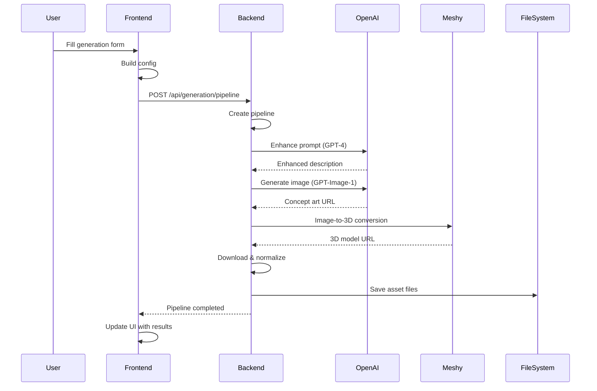
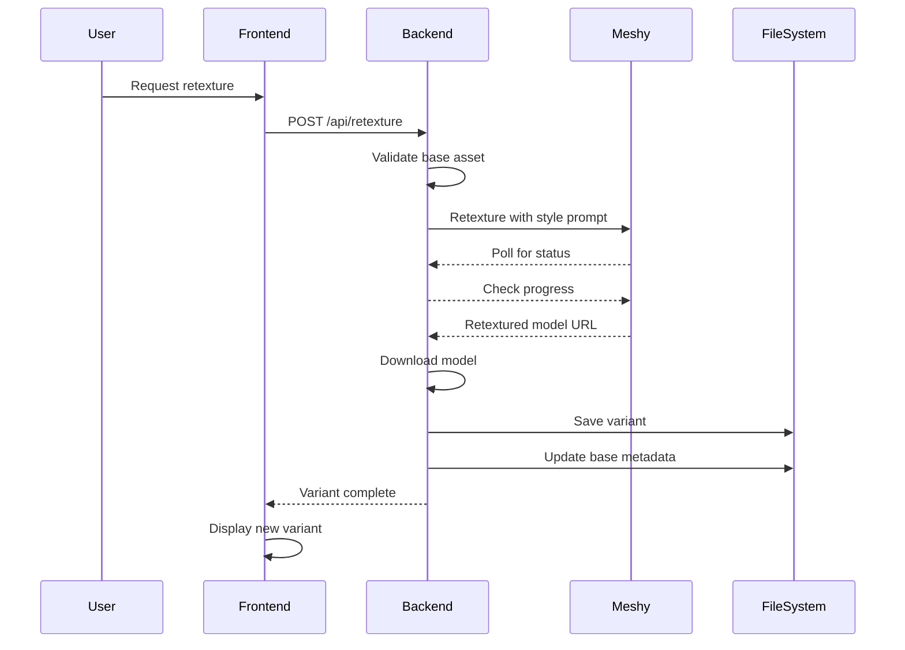
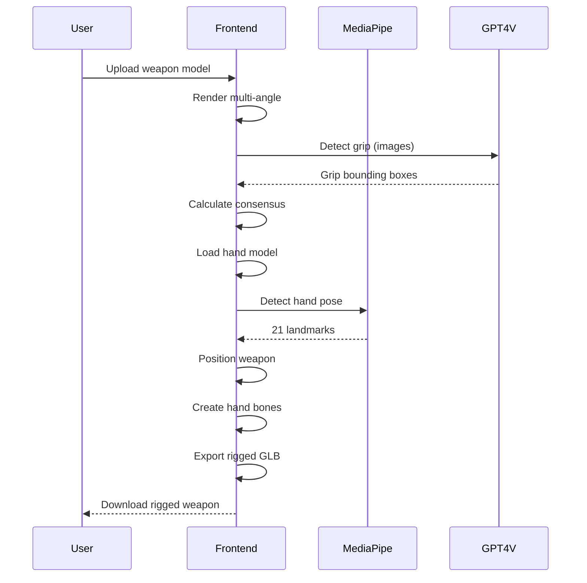

# Architecture Overview

[← Back to Index](../README.md)

---

## System Architecture

Asset Forge follows a **full-stack monorepo architecture** with clear separation between frontend, backend, and AI services.

---

## High-Level Architecture

```
┌─────────────────────────────────────────────────────┐
│                   Frontend (React)                  │
│  ┌────────────┐  ┌────────────┐  ┌───────────────┐  │
│  │   Pages    │  │ Components │  │  State Store  │  │
│  │  (Views)   │  │  (UI/UX)   │  │   (Zustand)   │  │
│  └────────────┘  └────────────┘  └───────────────┘  │
│         │               │                 │         │
│         └───────────────┴─────────────────┘         │
│                         │                           │
│                    Services Layer                   │
│  ┌─────────────────────────────────────────────┐    │
│  │  API Clients │ Processing │ 3D Rendering    │    │
│  └─────────────────────────────────────────────┘    │
└──────────────────────┬──────────────────────────────┘
                       │ HTTP/REST API
┌──────────────────────┴──────────────────────────────┐
│               Backend (Express.js)                  │
│  ┌────────────┐  ┌────────────┐  ┌───────────────┐  │
│  │   Routes   │  │  Services  │  │  Middleware   │  │ 
│  │ (Endpoints)│  │  (Logic)   │  │   (Error)     │  │
│  └────────────┘  └────────────┘  └───────────────┘  │
│         │               │                           │
│         └───────────────┴──────────────┐            │
│                                        │            │
│                                   AI Services       │
│  ┌──────────────────────────────────────────────┐   │
│  │  OpenAI GPT-4 │ DALL-E │ Meshy.ai │ TF.js   │    │
│  └──────────────────────────────────────────────┘   │
└─────────────────────────────────────────────────────┘
                         │
                    File System
         ┌───────────────┴───────────────┐
         │     gdd-assets/ (Storage)     │
         │  ┌──────────────────────────┐ │
         │  │ asset-id/                │ │
         │  │  ├── asset.glb           │ │
         │  │  ├── concept-art.png     │ │
         │  │  ├── metadata.json       │ │
         │  │  ├── animations/         │ │
         │  │  └── sprites/            │ │
         │  └──────────────────────────┘ │
         └───────────────────────────────┘
```

---

## Architecture Layers

### 1. Frontend Layer (React + Three.js)

**Responsibilities:**
- User interface and interaction
- 3D model rendering and visualization
- State management
- Form handling and validation
- Real-time progress tracking

**Technologies:**
- React 19.2 (UI framework)
- TypeScript 5.3 (Type safety)
- Three.js 0.178 (3D rendering)
- Zustand 5.0 (State management)
- Tailwind CSS 3.3 (Styling)

**Key Components:**
```
Frontend Architecture:
├─ Pages (5)
│  ├─ GenerationPage
│  ├─ AssetsPage
│  ├─ EquipmentPage
│  ├─ HandRiggingPage
│  └─ ArmorFittingPage
│
├─ Components (77 total)
│  ├─ common/ (12 reusable)
│  ├─ shared/ (3 shared)
│  ├─ Generation/ (17)
│  ├─ Assets/ (11)
│  ├─ Equipment/ (8)
│  ├─ HandRigging/ (10)
│  └─ ArmorFitting/ (16)
│
├─ Services (17)
│  ├─ api/ (3 API clients)
│  ├─ generation/ (1)
│  ├─ fitting/ (5)
│  ├─ hand-rigging/ (5)
│  └─ processing/ (3)
│
└─ Stores (5 Zustand)
   ├─ useGenerationStore
   ├─ useAssetsStore
   ├─ useHandRiggingStore
   ├─ useArmorFittingStore
   └─ useDebuggerStore
```

**Port**: 3000 (development)

### 2. Backend Layer (Express.js)

**Responsibilities:**
- REST API endpoints
- Business logic orchestration
- AI service integration
- File system management
- Error handling

**Technologies:**
- Node.js 18+ (Runtime)
- Express.js 4.18 (Web framework)
- Bun (Package manager)
- dotenv (Configuration)

**Key Components:**
```
Backend Architecture:
├─ API Server (api.mjs)
│  └─ Express app on port 3004
│
├─ Routes
│  ├─ Asset routes
│  ├─ Generation routes
│  ├─ Retexture routes
│  ├─ Weapon detection routes
│  └─ Prompt routes
│
├─ Services
│  ├─ GenerationService (pipeline)
│  ├─ AICreationService (AI calls)
│  ├─ AssetService (CRUD)
│  ├─ RetextureService (variants)
│  └─ ImageHostingService (images)
│
└─ Middleware
   └─ errorHandler
```

**Ports**:
- 3004 (API server)
- 8081 (Image server)

### 3. AI Services Layer

**External Services:**

**OpenAI:**
- GPT-4: Prompt enhancement
- GPT-4o-mini Vision: Weapon grip detection
- GPT-Image-1: Concept art generation

**Meshy.ai:**
- Image-to-3D: 3D model generation
- Retexture: Material variants
- Rigging: Character skeletons + animations

**TensorFlow.js + MediaPipe:**
- Hand pose detection
- 21-point hand landmarks
- Finger bone mapping

### 4. Storage Layer

**File System Structure:**
```
gdd-assets/
├─ asset-id/              # Base model directory
│  ├─ asset-id.glb        # Normalized model
│  ├─ asset-id_raw.glb    # Original Meshy output
│  ├─ concept-art.png     # AI-generated concept
│  ├─ metadata.json       # Asset metadata
│  ├─ t-pose.glb          # T-pose extraction (characters)
│  ├─ asset-id_rigged.glb # Rigged model (characters)
│  ├─ animations/
│  │  ├─ walking.glb
│  │  └─ running.glb
│  └─ sprites/
│     ├─ 0deg.png
│     ├─ 45deg.png
│     └─ sprite-metadata.json
│
├─ asset-id-bronze/       # Material variant
│  ├─ asset-id-bronze.glb
│  ├─ concept-art.png     # Copied from base
│  └─ metadata.json
│
└─ .dependencies.json     # Cross-asset dependencies
```

---

## Data Flow Patterns

### 1. Asset Generation Flow



### 2. Material Variant Flow



### 3. Hand Rigging Flow



---

## Communication Patterns

### Frontend ↔ Backend

**Protocol**: HTTP/REST API
**Format**: JSON
**Authentication**: API keys in headers

**Request Pattern:**
```typescript
// Frontend API call
const response = await apiFetch('/api/generation/pipeline', {
  method: 'POST',
  headers: { 'Content-Type': 'application/json' },
  body: JSON.stringify(config)
})
```

**Response Pattern:**
```json
{
  "pipelineId": "pipeline-123",
  "status": "processing",
  "message": "Pipeline started"
}
```

### Backend ↔ AI Services

**OpenAI Communication:**
```typescript
// GPT-4 Chat Completion
const response = await fetch('https://api.openai.com/v1/chat/completions', {
  method: 'POST',
  headers: {
    'Authorization': `Bearer ${OPENAI_API_KEY}`,
    'Content-Type': 'application/json'
  },
  body: JSON.stringify({
    model: 'gpt-4',
    messages: [{ role: 'user', content: prompt }]
  })
})
```

**Meshy.ai Communication:**
```typescript
// Image-to-3D
const response = await fetch('https://api.meshy.ai/openapi/v1/image-to-3d', {
  method: 'POST',
  headers: {
    'Authorization': `Bearer ${MESHY_API_KEY}`,
    'Content-Type': 'application/json'
  },
  body: JSON.stringify({
    image_url: publicImageUrl,
    enable_pbr: true,
    ai_model: 'meshy-5',
    target_polycount: 12000
  })
})

// Poll for completion
const pollStatus = async (taskId) => {
  const status = await fetch(`https://api.meshy.ai/openapi/v1/image-to-3d/${taskId}`)
  // Repeat until status === 'SUCCEEDED'
}
```

### Frontend Three.js Rendering

**3D Model Loading:**
```typescript
import { GLTFLoader } from 'three/examples/jsm/loaders/GLTFLoader'

const loader = new GLTFLoader()
const gltf = await loader.loadAsync(modelUrl)
scene.add(gltf.scene)
```

---

## State Management Architecture

### Zustand Store Pattern

```typescript
export const useGenerationStore = create<State>()(
  devtools(
    persist(
      subscribeWithSelector(
        immer((set, get) => ({
          // State
          assetName: '',
          isGenerating: false,

          // Actions
          setAssetName: (name) => set((state) => {
            state.assetName = name
          })
        }))
      ),
      { name: 'generation-store' }
    )
  )
)
```

**Middleware Stack:**
1. **Immer**: Immutable updates with mutable syntax
2. **SubscribeWithSelector**: Granular subscriptions
3. **Persist**: LocalStorage persistence
4. **DevTools**: Redux DevTools integration

**Store Responsibilities:**

| Store | Purpose | Key State |
|-------|---------|-----------|
| **useGenerationStore** | Asset generation pipeline | Pipeline status, config, results |
| **useAssetsStore** | Asset browsing/viewing | Selected asset, filters, viewer |
| **useHandRiggingStore** | Hand rigging workflow | Processing stage, hand data |
| **useArmorFittingStore** | Armor fitting operations | Fitting config, history, progress |
| **useDebuggerStore** | Mesh fitting debugger | Debug params, visualization |

---

## Service Architecture

### Frontend Services

**API Clients:**
```
api/
├─ GenerationAPIClient.ts    # Pipeline management
├─ PromptService.ts           # Prompt templates
└─ AssetService.ts            # Asset CRUD
```

**Processing Services:**
```
processing/
├─ AssetNormalizationService.ts    # Model normalization
├─ CreatureScalingService.ts       # Size scaling
└─ WeaponHandleDetector.ts         # Grip detection
```

**Fitting Services:**
```
fitting/
├─ ArmorFittingService.ts          # Armor fitting orchestration
├─ MeshFittingService.ts           # Shrinkwrap algorithm
├─ WeightTransferService.ts        # Bone weights
├─ ArmorScaleFixer.ts              # Scale normalization
└─ BoneDiagnostics.ts              # Skeleton analysis
```

**Hand Rigging Services:**
```
hand-rigging/
├─ HandRiggingService.ts           # Main orchestrator
├─ HandPoseDetectionService.ts     # MediaPipe integration
├─ HandSegmentationService.ts      # Finger masks
├─ OrthographicHandRenderer.ts     # Hand capture
└─ SimpleHandRiggingService.ts     # Lightweight rigging
```

### Backend Services

**Core Services:**
```
server/services/
├─ GenerationService.mjs           # Pipeline orchestration
├─ AICreationService.mjs           # AI API wrapper
├─ AssetService.mjs                # Asset management
├─ RetextureService.mjs            # Material variants
└─ ImageHostingService.mjs         # Image upload
```

**Service Interactions:**
```
GenerationService
├─ Uses AICreationService for AI calls
├─ Uses AssetService for file I/O
├─ Uses ImageHostingService for uploads
└─ Emits progress events
```

---

## Error Handling

### Frontend Error Handling

```typescript
try {
  const result = await apiCall('/api/generation/pipeline', config)
  notify.success('Pipeline started')
} catch (error) {
  notify.error(error.message || 'Generation failed')
  console.error('Pipeline error:', error)
}
```

### Backend Error Handling

```javascript
// Global error handler middleware
export function errorHandler(err, req, res, next) {
  console.error({
    message: err.message,
    stack: process.env.NODE_ENV !== 'production' ? err.stack : undefined,
    path: req.path,
    method: req.method,
    timestamp: new Date().toISOString()
  })

  res.status(err.statusCode || 500).json({
    error: err.message,
    stack: process.env.NODE_ENV !== 'production' ? err.stack : undefined
  })
}
```

---

## Security Architecture

### API Key Management

**Environment Variables:**
```bash
# Frontend (VITE_ prefix required)
VITE_OPENAI_API_KEY=sk-...
VITE_MESHY_API_KEY=...

# Backend
OPENAI_API_KEY=sk-...
MESHY_API_KEY=...
```

**Access Control:**
- API keys stored in `.env` (not committed)
- Frontend keys exposed in browser (public usage)
- Backend keys hidden from client
- No authentication layer (local development tool)

### CORS Configuration

```javascript
// Custom CORS middleware
app.use((req, res, next) => {
  const origin = process.env.NODE_ENV === 'production'
    ? process.env.FRONTEND_URL
    : 'http://localhost:3000'

  res.header('Access-Control-Allow-Origin', origin)
  res.header('Access-Control-Allow-Credentials', 'true')
  res.header('Access-Control-Allow-Methods', 'GET, POST, PUT, DELETE, OPTIONS')
  next()
})
```

### File System Security

**Directory Traversal Prevention:**
```javascript
const assetPath = path.join(ASSETS_DIR, assetId, filename)
if (!assetPath.startsWith(ASSETS_DIR)) {
  throw new Error('Invalid path')
}
```

---

## Performance Architecture

### Optimization Strategies

**1. Code Splitting:**
- React.lazy() for route-based splitting
- Dynamic imports for large dependencies
- Separate chunks for Three.js

**2. Caching:**
- Prompt template caching (in-memory Map)
- LocalStorage for user preferences
- Service Worker for asset caching (future)

**3. Debouncing:**
- Search input: 300ms debounce
- Filter changes: 200ms debounce
- Window resize: 150ms debounce

**4. Lazy Loading:**
- 3D models loaded on-demand
- Images lazy-loaded in grid view
- Components loaded per route

**5. Resource Cleanup:**
```typescript
// Three.js cleanup
useEffect(() => {
  return () => {
    geometry.dispose()
    material.dispose()
    renderer.dispose()
    URL.revokeObjectURL(blobUrl)
  }
}, [])
```

---

## Scalability Considerations

### Current Limitations

1. **In-Memory Pipeline State**: Lost on server restart
2. **File-Based Storage**: No database, limited search
3. **Single-Threaded**: Node.js event loop
4. **Local Development**: Not production-ready

### Future Scaling Options

**Database Layer:**
- PostgreSQL for metadata
- S3 for model storage
- Redis for pipeline state

**Microservices:**
- Separate generation service
- Dedicated file server
- Queue-based processing

**Containerization:**
- Docker containers
- Kubernetes orchestration
- Horizontal scaling

---

## Deployment Architecture

### Development

```
├─ Frontend: Vite dev server (port 3000)
├─ Backend API: Node.js (port 3004)
├─ Image Server: Express static (port 8081)
└─ Storage: Local file system (gdd-assets/)
```

### Production (Future)

```
├─ Frontend: Static files (CDN)
├─ Backend: Containerized Node.js
├─ Database: PostgreSQL
├─ Storage: S3 or equivalent
└─ Queue: Redis/RabbitMQ
```

---

## Next Steps

Explore detailed architecture documentation:

- [Frontend Architecture](../04-architecture/frontend-architecture.md)
- [Backend Architecture](../04-architecture/backend-architecture.md)
- [State Management](../04-architecture/state-management.md)
- [Data Flow](../04-architecture/data-flow.md)

---

[← Back to Features](features.md) | [Next: Tech Stack →](tech-stack.md)
