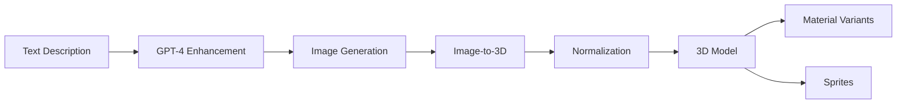
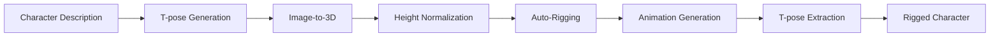

# Introduction to Asset Forge

[← Back to Index](../README.md)

---

## What is Asset Forge?

Asset Forge is a comprehensive **AI-powered 3D asset generation and management system** designed for game development. It transforms text descriptions into production-ready 3D models, complete with materials, rigging, and animations.

### Purpose

Asset Forge solves the challenge of creating consistent, game-ready 3D assets at scale by:

- **Automating asset creation** through AI-powered generation
- **Standardizing asset formats** with normalization and conventions
- **Accelerating iteration** with material variants and quick regeneration
- **Enabling non-artists** to create professional 3D content
- **Managing asset libraries** with comprehensive metadata

### Built for Hyperscape

Asset Forge was specifically created for the [Hyperscape RPG project](../../../README.md), a multiplayer 3D game engine. It generates:

- **Characters**: Humanoid and creature models with rigging
- **Weapons**: Swords, axes, bows, staffs with proper grip points
- **Armor**: Helmets, chest pieces, legs fitted to characters
- **Buildings**: Banks, stores, temples with functional layouts
- **Resources**: Ores, bars, logs, gems
- **Tools**: Pickaxes, fishing rods, hammers

---

## Core Capabilities

### 1. Text-to-3D Generation

Transform simple descriptions into detailed 3D models:

```
Input: "A bronze medieval sword with ornate crossguard"
Output:
  ✓ 3D GLB model (6,000-20,000 polys)
  ✓ PBR textures (1024-4096px)
  ✓ Concept art
  ✓ Metadata with dimensions
```

**Powered by:**
- OpenAI GPT-4 for prompt enhancement
- OpenAI GPT-Image-1 for concept art
- Meshy.ai for image-to-3D conversion

### 2. Material Variant System

Automatically generate material variants from a base model:

```
Base Model: "steel_sword"
Variants Generated:
  ├─ bronze_sword (tier 1)
  ├─ steel_sword (tier 2)
  ├─ mithril_sword (tier 3)
  └─ dragon_sword (tier 10, custom)
```

Each variant has:
- Unique material textures
- Tier-based coloring
- Style consistency
- Linked metadata

### 3. Character Auto-Rigging

Generate rigged characters ready for animation:

```
Input: Character description + T-pose requirement
Output:
  ✓ Rigged skeleton (humanoid-standard)
  ✓ Walking animation
  ✓ Running animation
  ✓ T-pose extraction
  ✓ Height normalization (1.7m default)
```

**Powered by**: Meshy.ai rigging API

### 4. Hand Rigging for Weapons

Automatically rig weapons to hand poses:

```
Workflow:
1. AI detects weapon grip area (GPT-4 Vision)
2. MediaPipe detects hand pose (21 landmarks)
3. Calculate grip alignment
4. Position weapon at origin
5. Export rigged weapon
```

**Powered by**: TensorFlow.js + MediaPipe Hands

### 5. Armor Fitting

Fit armor pieces to any character model:

```
Fitting Methods:
├─ Shrinkwrap: Mesh deformation to character surface
├─ Collision: Physics-based fitting
└─ Smooth: Smooth deformation with feature preservation

Weight Transfer:
├─ Nearest Point
├─ Projected Surface
└─ Inpainted (gap filling)
```

### 6. Sprite Generation

Convert 3D models to 2D sprites:

```
Configuration:
├─ Angles: 8-direction (0°, 45°, 90°, etc.)
├─ Resolution: 512x512px (configurable)
├─ Background: Transparent PNG
└─ Lighting: Consistent orthographic
```

---

## Key Benefits

### For Game Developers

- **Rapid Prototyping**: Generate placeholder assets in minutes
- **Consistent Style**: Maintain art style across all assets
- **Easy Iteration**: Regenerate with tweaked descriptions
- **No 3D Skills Required**: Text descriptions become 3D models

### For 3D Artists

- **Workflow Acceleration**: Generate base meshes to refine
- **Variant Creation**: Automate material variants
- **Rigging Automation**: Skip manual rigging for standard characters
- **Batch Processing**: Generate multiple assets in parallel

### For RPG Projects

- **Tier Systems**: Bronze → Steel → Mithril progression
- **Equipment Sets**: Consistent armor and weapon sets
- **NPC Generation**: Rapid character creation
- **Building Library**: Reusable structures

---

## Generation Quality Levels

Asset Forge supports three quality tiers:

| Quality | Polycount | Texture | PBR | Model | Use Case |
|---------|-----------|---------|-----|-------|----------|
| **Standard** | 6,000 | 1024px | No | meshy-5 | Placeholder/testing |
| **High** | 12,000 | 2048px | Yes | meshy-5 | Production assets |
| **Ultra** | 20,000 | 4096px | Yes | meshy-5 | Hero assets |

**Performance Notes:**
- Standard: 2-4 minutes generation time
- High: 5-8 minutes generation time
- Ultra: 10-20 minutes generation time

---

## Workflow Overview

### Basic Generation Workflow



### Advanced Workflow (Avatars)



---

## Asset Types Supported

### Characters

- **Humanoid**: Humans, elves, dwarves
- **Creatures**: Goblins, dragons, animals
- **NPCs**: Shopkeepers, guards, villagers
- **Bosses**: Large-scale enemies

**Features**: Auto-rigging, animations, height scaling

### Weapons

- **Melee**: Sword, axe, mace, spear, dagger
- **Ranged**: Bow, crossbow
- **Magic**: Staff, wand
- **Defense**: Shield

**Features**: Handle detection, hand rigging, size constraints

### Armor

- **Head**: Helmet, hood, crown
- **Body**: Chest plate, robe
- **Legs**: Greaves, pants
- **Hands**: Gloves, gauntlets
- **Accessories**: Cape, amulet, ring

**Features**: Armor fitting, weight transfer, material variants

### Buildings

- **Functional**: Bank, store, guild hall
- **Residential**: House, inn
- **Religious**: Temple, shrine
- **Defensive**: Castle, tower, dungeon

**Features**: Interior space, entry points, NPC positions

### Resources & Tools

- **Resources**: Ore, bar, log, plank, gem, herb, fish
- **Tools**: Pickaxe, axe, fishing rod, hammer, chisel

**Features**: Material variants, size normalization

---

## Target Audience

### Primary Users

1. **Game Developers**: Building RPGs or multiplayer games
2. **3D Artists**: Accelerating asset creation workflows
3. **Indie Developers**: Solo developers without 3D skills
4. **Content Creators**: Creating game mods or custom content

### Technical Requirements

- **Skill Level**: No 3D modeling experience required
- **API Access**: OpenAI and Meshy.ai accounts
- **Hardware**: 4GB+ RAM recommended
- **Browser**: Modern browser with WebGPU support (Chrome 113+, Safari 17+)

---

## Integration with Hyperscape

Asset Forge is tightly integrated with the Hyperscape game engine:

### Asset Loading

```typescript
// Hyperscape loads Asset Forge models
const asset = await world.loadAsset('steel-sword')
world.spawnItem(asset, position)
```

### Metadata Integration

```typescript
// Game reads Asset Forge metadata
const metadata = asset.metadata
const tier = metadata.tier // 1-10
const type = metadata.type // 'weapon'
```

### File Structure

```
gdd-assets/
├── steel-sword/           # Asset Forge generates
│   ├── steel-sword.glb    # Hyperscape loads
│   └── metadata.json      # Hyperscape reads
```

---

## Next Steps

Now that you understand what Asset Forge is, explore:

- [Features Overview](features.md) - Detailed feature list
- [Architecture](architecture.md) - System design
- [Tech Stack](tech-stack.md) - Technologies used
- [Installation Guide](../02-getting-started/installation.md) - Get started

---

[← Back to Index](../README.md) | [Next: Features →](features.md)
