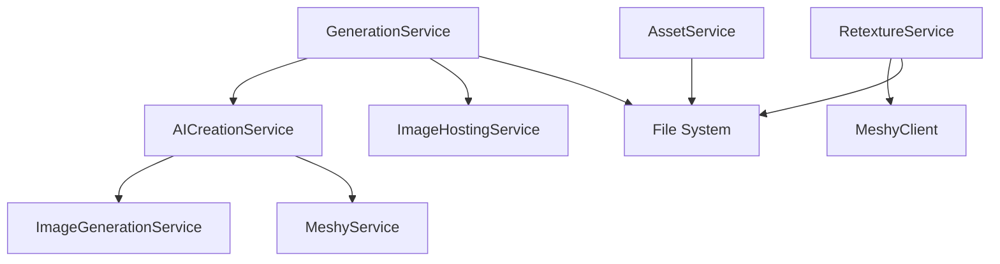

# Backend Services

The Asset Forge backend is built on a service-oriented architecture with six core services handling different aspects of AI-powered 3D asset generation. Each service is designed to be modular, testable, and focused on a single responsibility.

## Table of Contents

- [Service Architecture](#service-architecture)
- [GenerationService](#generationservice)
- [AICreationService](#aicreationservice)
- [AssetService](#assetservice)
- [RetextureService](#retextureservice)
- [ImageHostingService](#imagehostingservice)
- [Service Dependencies](#service-dependencies)
- [Error Handling Patterns](#error-handling-patterns)
- [Performance Considerations](#performance-considerations)

## Service Architecture

### Design Principles

1. **Single Responsibility**: Each service handles one domain
2. **Dependency Injection**: Services receive dependencies via constructor
3. **Event-Driven**: GenerationService uses EventEmitter for progress updates
4. **Stateless Operations**: Services don't maintain session state
5. **Error Propagation**: Errors bubble up with context
6. **Async-First**: All I/O operations use async/await

### Service Hierarchy

```
GenerationService (orchestrator)
├── AICreationService
│   ├── ImageGenerationService (OpenAI)
│   └── MeshyService (Meshy AI)
├── ImageHostingService
└── File System Operations

RetextureService (standalone)
└── MeshyClient (Meshy AI)

AssetService (CRUD)
└── File System Operations
```

### File Locations

```
server/
├── services/
│   ├── GenerationService.mjs      # 1,027 lines - Pipeline orchestration
│   ├── AICreationService.mjs      # 245 lines - AI API wrapper
│   ├── AssetService.mjs           # 305 lines - Asset CRUD
│   ├── RetextureService.mjs       # 379 lines - Material variants
│   └── ImageHostingService.mjs    # 110 lines - Image upload
└── utils/
    └── promptLoader.mjs           # 147 lines - Prompt management
```

## GenerationService

**File:** `server/services/GenerationService.mjs`
**Lines:** 1,027
**Purpose:** Orchestrate multi-stage AI generation pipelines

### Overview

GenerationService is the heart of Asset Forge, coordinating the entire asset generation workflow from text prompt to finished 3D model with variants and animations. It manages pipeline state, handles errors gracefully, and provides real-time progress updates.

### Class Structure

```javascript
export class GenerationService extends EventEmitter {
  constructor()

  // Pipeline Management
  async startPipeline(config)
  async getPipelineStatus(pipelineId)
  async processPipeline(pipelineId)

  // AI Enhancement
  async enhancePromptWithGPT4(config)
  extractKeywords(prompt)

  // Utilities
  async downloadFile(url)
  async extractTPoseFromAnimation(inputPath, outputPath)
  cleanupOldPipelines()
}
```

### Constructor

```javascript
constructor() {
  super()

  this.activePipelines = new Map()

  // Check for required API keys
  if (!process.env.OPENAI_API_KEY || !process.env.MESHY_API_KEY) {
    console.warn('[GenerationService] Missing API keys')
  }

  // Initialize AI service
  this.aiService = new AICreationService({
    openai: {
      apiKey: process.env.OPENAI_API_KEY || '',
      model: 'gpt-image-1',
      imageServerBaseUrl: process.env.IMAGE_SERVER_URL || 'http://localhost:8080'
    },
    meshy: {
      apiKey: process.env.MESHY_API_KEY || '',
      baseUrl: 'https://api.meshy.ai'
    },
    cache: {
      enabled: true,
      ttl: 3600,
      maxSize: 500
    },
    output: {
      directory: 'gdd-assets',
      format: 'glb'
    }
  })

  // Initialize image hosting service
  this.imageHostingService = new ImageHostingService()
}
```

### Starting a Pipeline

```javascript
async startPipeline(config)
```

Creates a new generation pipeline with initial state.

**Parameters:**
- `config` (object): Pipeline configuration
  - `name` (string): Asset display name
  - `description` (string): Asset description
  - `type` (string): Asset type (character, weapon, etc.)
  - `subtype` (string): Asset subtype
  - `assetId` (string): Unique identifier
  - `generationType` (string): avatar or item
  - `style` (string): Visual style
  - `quality` (string): standard, high, or ultra
  - `enableRigging` (boolean): Enable character rigging
  - `enableRetexturing` (boolean): Generate material variants
  - `enableSprites` (boolean): Generate sprite renders
  - `materialPresets` (array): Material variant configs
  - `referenceImage` (object): User-provided reference
  - `metadata` (object): Additional metadata

**Returns:** `{ pipelineId, status, message }`

**Example:**
```javascript
const result = await generationService.startPipeline({
  assetId: 'goblin-warrior',
  name: 'Goblin Warrior',
  description: 'A fierce goblin warrior',
  type: 'character',
  subtype: 'humanoid',
  generationType: 'avatar',
  quality: 'high',
  enableRigging: true,
  enableRetexturing: true,
  materialPresets: [
    { id: 'bronze', displayName: 'Bronze', stylePrompt: '...' }
  ]
})

console.log(result.pipelineId) // "pipeline-1729506000000-a1b2c3d4e"
```

### Pipeline Processing

```javascript
async processPipeline(pipelineId)
```

Executes all pipeline stages sequentially.

**Pipeline Stages:**

1. **Prompt Optimization** (GPT-4)
   - Skipped if `metadata.useGPT4Enhancement === false`
   - Enhances prompt with GPT-4 for better results
   - Falls back to original prompt on error

2. **Image Generation** (OpenAI GPT-Image-1)
   - Skipped if user provides reference image
   - Generates 1024x1024 concept art
   - Adds T-pose prompts for characters
   - Adds armor shape prompts for armor pieces

3. **Image to 3D** (Meshy AI)
   - Converts image to 3D model
   - Supports quality presets (standard/high/ultra)
   - Normalizes character height (default 1.83m)
   - Normalizes weapon grip to origin
   - Polls every 5 seconds for completion
   - Configurable timeout per quality level

4. **Texture Generation** (Meshy Retexture)
   - Skipped if `enableRetexturing === false`
   - Generates material variant for each preset
   - Uses Meshy retexture API
   - Creates variant directories with metadata

5. **Auto-Rigging** (Meshy Rigging)
   - Only for avatars if `enableRigging === true`
   - Adds humanoid skeleton
   - Generates walking and running animations
   - Extracts T-pose model from animations
   - Creates separate rigged model for animation player

**Stage State Transitions:**
```
pending → processing → completed
pending → skipped (conditions not met)
processing → failed (error occurred)
```

**Error Handling:**
- Rigging failures continue pipeline (non-critical)
- Other stage failures halt pipeline
- Errors stored in `pipeline.error` and `stage.error`

### Prompt Enhancement

```javascript
async enhancePromptWithGPT4(config)
```

Enhances user prompts with GPT-4 for better AI generation results.

**Parameters:**
- `config` (object): Pipeline configuration

**Returns:**
```javascript
{
  originalPrompt: "A goblin warrior",
  optimizedPrompt: "A menacing goblin warrior in T-pose with leather armor...",
  model: "gpt-4",
  keywords: ["goblin", "warrior", "leather", "low-poly"]
}
```

**Prompt Templates:**

The enhancement uses type-specific templates:

**Character Template:**
```
You are an expert at optimizing prompts for 3D asset generation.

CRITICAL for characters: The character MUST be in a T-pose (arms stretched
out horizontally, legs slightly apart) for proper rigging. The character must
have EMPTY HANDS - no weapons, tools, or held items.

Focus on:
- Clear, specific visual details
- Material and texture descriptions
- Geometric shape and form
- Style consistency (especially for low-poly RuneScape style)
- T-pose stance with empty hands for rigging compatibility

Keep the enhanced prompt concise but detailed.
```

**Armor Template:**
```
CRITICAL for armor pieces: The armor must be shown ALONE without any armor
stand, mannequin, or body inside.

EXTRA IMPORTANT for chest/body armor: This MUST be shaped for a SCARECROW
POSE (T-POSE) - imagine a scarecrow with arms sticking STRAIGHT OUT SIDEWAYS
at 90 degrees like a cross.

Focus on:
- Armor SHAPED for T-pose body (shoulder openings pointing straight sideways)
- Chest armor should form a "T" or cross shape when viewed from above
- Shoulder openings at 180° angle to each other (straight line across)
```

**Fallback Enhancement:**
If GPT-4 fails, uses template:
```
${description}. ${style} style, clean geometry, game-ready 3D asset.
```

### T-Pose Extraction

```javascript
async extractTPoseFromAnimation(inputPath, outputPath)
```

Extracts a static T-pose model from a rigged animation GLB by removing animation data.

**Parameters:**
- `inputPath` (string): Path to walking.glb with animations
- `outputPath` (string): Path for T-pose output

**Process:**
1. Parse GLB binary format
2. Extract JSON chunk
3. Parse glTF JSON structure
4. Remove `animations` array
5. Repack GLB with updated JSON

**GLB Structure:**
```
Header (12 bytes)
├── Magic: 0x46546C67 ('glTF')
├── Version: 2
└── Length: Total file size

JSON Chunk
├── Length (4 bytes)
├── Type: 'JSON' (4 bytes)
└── Data: glTF JSON

Binary Chunk
├── Length (4 bytes)
├── Type: 'BIN\0' (4 bytes)
└── Data: Buffer data
```

### Pipeline Cleanup

```javascript
cleanupOldPipelines()
```

Removes completed/failed pipelines older than 1 hour.

**Runs Every:** 30 minutes (via setInterval)

**Logic:**
```javascript
const oneHourAgo = Date.now() - (60 * 60 * 1000)
for (const [id, pipeline] of this.activePipelines.entries()) {
  const createdAt = new Date(pipeline.createdAt).getTime()
  if (createdAt < oneHourAgo &&
      (pipeline.status === 'completed' || pipeline.status === 'failed')) {
    this.activePipelines.delete(id)
  }
}
```

## AICreationService

**File:** `server/services/AICreationService.mjs`
**Lines:** 245
**Purpose:** Wrapper for OpenAI and Meshy AI APIs

### Overview

AICreationService provides a unified interface to two AI providers: OpenAI for image generation and Meshy for 3D conversion, retexturing, and rigging. It abstracts API details and provides consistent error handling.

### Class Structure

```javascript
export class AICreationService {
  constructor(config)
  // Properties: imageService, meshyService
}

class ImageGenerationService {
  constructor(config)
  async generateImage(description, assetType, style)
}

class MeshyService {
  constructor(config)
  async startImageTo3D(imageUrl, options)
  async getTaskStatus(taskId)
  async startRetextureTask(input, style, options)
  async getRetextureTaskStatus(taskId)
  async startRiggingTask(input, options)
  async getRiggingTaskStatus(taskId)
}
```

### Image Generation

```javascript
async generateImage(description, assetType, style)
```

Generates concept art using OpenAI's GPT-Image-1 model.

**Parameters:**
- `description` (string): Asset description
- `assetType` (string): Asset type (character, weapon, etc.)
- `style` (string): Visual style (runescape, skyrim, etc.)

**Returns:**
```javascript
{
  imageUrl: "data:image/png;base64,iVBORw0KGgo...",
  prompt: "A fierce goblin warrior. low-poly RuneScape style...",
  metadata: {
    model: "gpt-image-1",
    resolution: "1024x1024",
    quality: "high",
    timestamp: "2025-10-21T10:30:00.000Z"
  }
}
```

**API Request:**
```javascript
const response = await fetch('https://api.openai.com/v1/images/generations', {
  method: 'POST',
  headers: {
    'Authorization': `Bearer ${this.apiKey}`,
    'Content-Type': 'application/json'
  },
  body: JSON.stringify({
    model: 'gpt-image-1',
    prompt: prompt,
    size: '1024x1024',
    quality: 'high'
  })
})
```

**Response Handling:**
- Supports both URL and base64 responses
- Converts base64 to data URI format
- Throws descriptive errors on failure

### Meshy Image-to-3D

```javascript
async startImageTo3D(imageUrl, options)
```

Starts 3D model generation from image.

**Parameters:**
- `imageUrl` (string): Publicly accessible image URL
- `options` (object):
  - `enable_pbr` (boolean): Enable PBR textures
  - `ai_model` (string): Model version (meshy-4, meshy-5)
  - `topology` (string): Mesh topology (quad, triangle)
  - `targetPolycount` (number): Target polygon count
  - `texture_resolution` (number): Texture size in pixels

**Returns:** Task ID string for polling

**Example:**
```javascript
const taskId = await meshyService.startImageTo3D(imageUrl, {
  enable_pbr: true,
  ai_model: 'meshy-5',
  topology: 'quad',
  targetPolycount: 12000,
  texture_resolution: 2048
})
```

**Quality Presets:**
```javascript
// Standard
{ targetPolycount: 6000, texture_resolution: 1024, enable_pbr: false }

// High
{ targetPolycount: 12000, texture_resolution: 2048, enable_pbr: true }

// Ultra
{ targetPolycount: 20000, texture_resolution: 4096, enable_pbr: true }
```

### Meshy Retexture

```javascript
async startRetextureTask(input, style, options)
```

Applies material textures to existing 3D model.

**Parameters:**
- `input` (object):
  - `inputTaskId` (string): Base model task ID
  - OR `modelUrl` (string): Direct model URL
- `style` (object):
  - `textStylePrompt` (string): Material description
  - OR `imageStyleUrl` (string): Reference image URL
- `options` (object):
  - `artStyle` (string): realistic or stylized
  - `aiModel` (string): meshy-5 (default)
  - `enableOriginalUV` (boolean): Preserve UV mapping

**Returns:** Task ID string for polling

**Example:**
```javascript
const taskId = await meshyService.startRetextureTask(
  { inputTaskId: 'img3d_abc123' },
  { textStylePrompt: 'bronze metal texture with oxidized patina' },
  { artStyle: 'realistic', aiModel: 'meshy-5', enableOriginalUV: true }
)
```

### Meshy Rigging

```javascript
async startRiggingTask(input, options)
```

Adds humanoid skeleton and animations to character model.

**Parameters:**
- `input` (object):
  - `inputTaskId` (string): Model task ID
  - OR `modelUrl` (string): Direct model URL
- `options` (object):
  - `heightMeters` (number): Character height (default: 1.7m)

**Returns:** Task ID string for polling

**Example:**
```javascript
const taskId = await meshyService.startRiggingTask(
  { inputTaskId: 'img3d_abc123' },
  { heightMeters: 1.83 }
)
```

**Rigging Result:**
```javascript
{
  status: "SUCCEEDED",
  result: {
    basic_animations: {
      walking_glb_url: "https://api.meshy.ai/...",
      running_glb_url: "https://api.meshy.ai/..."
    }
  }
}
```

## AssetService

**File:** `server/services/AssetService.mjs`
**Lines:** 305
**Purpose:** CRUD operations for asset files and metadata

### Overview

AssetService manages the local file system storage for generated assets. It handles listing, loading, updating, and deleting assets while maintaining metadata consistency and dependency tracking.

### Class Structure

```javascript
export class AssetService {
  constructor(assetsDir)

  // Read Operations
  async listAssets()
  async loadAsset(assetId)
  async getAssetMetadata(assetId)
  async getModelPath(assetId)

  // Write Operations
  async updateAsset(assetId, updates)
  async deleteAsset(assetId, includeVariants)

  // Internal Helpers
  async deleteAssetDirectory(assetId)
  async updateDependencies(deletedAssetId, newId)
}
```

### Listing Assets

```javascript
async listAssets()
```

Returns array of all assets sorted by generation date (newest first).

**Returns:**
```javascript
[
  {
    id: "goblin-warrior-base",
    name: "goblin-warrior-base",
    description: "A fierce goblin warrior",
    type: "character",
    metadata: { /* full metadata */ },
    hasModel: true,
    modelFile: "goblin-warrior-base.glb",
    generatedAt: "2025-10-21T10:30:00.000Z"
  }
]
```

**Error Handling:**
- Skips assets without valid metadata.json
- Skips hidden files (starting with `.`)
- Skips non-directory files
- Returns empty array on directory read error

### Loading Single Asset

```javascript
async loadAsset(assetId)
```

Loads a single asset's metadata and file information.

**Returns:** Asset object or `null` if not found

**Example:**
```javascript
const asset = await assetService.loadAsset('goblin-warrior-base')
if (!asset) {
  console.log('Asset not found')
}
```

### Getting Model Path

```javascript
async getModelPath(assetId)
```

Returns absolute path to asset's primary model file.

**Character Model Selection:**
```javascript
// For characters, prefer rigged model
if (metadata.type === 'character' && metadata.riggedModelPath) {
  // Return gdd-assets/{assetId}/{assetId}_rigged.glb
  return riggedPath
}

// Otherwise, return first .glb file
return path.join(assetPath, glbFile)
```

**Throws:** Error if asset or model not found

### Updating Assets

```javascript
async updateAsset(assetId, updates)
```

Updates asset metadata and optionally renames asset directory.

**Parameters:**
- `assetId` (string): Current asset ID
- `updates` (object):
  - `name` (string): New asset name (triggers rename)
  - `type` (string): New asset type
  - `metadata` (object): Metadata fields to merge

**Rename Process:**
1. Validate new name doesn't exist
2. Create new directory with new name
3. Move all files to new directory
4. Update metadata.json with new name
5. Update dependencies file
6. Delete old directory

**Example:**
```javascript
const updated = await assetService.updateAsset('goblin-warrior-base', {
  name: 'goblin-warrior-v2',
  metadata: {
    description: 'Updated description',
    tags: ['enemy', 'goblin']
  }
})
```

### Deleting Assets

```javascript
async deleteAsset(assetId, includeVariants = false)
```

Deletes asset directory and optionally its material variants.

**Parameters:**
- `assetId` (string): Asset to delete
- `includeVariants` (boolean): Also delete material variants

**Cascade Deletion:**
```javascript
// If base model with variants
if (metadata.isBaseModel && includeVariants) {
  // Find all variants
  const variants = allAssets.filter(
    asset => asset.metadata.parentBaseModel === assetId
  )

  // Delete each variant
  for (const variant of variants) {
    await this.deleteAssetDirectory(variant.id)
  }
}

// Delete main asset
await this.deleteAssetDirectory(assetId)

// Update dependencies
await this.updateDependencies(assetId)
```

### Dependency Tracking

```javascript
async updateDependencies(deletedAssetId, newId)
```

Updates `.dependencies.json` file after deletions or renames.

**Dependency File Structure:**
```json
{
  "steel-sword-base": {
    "variants": ["steel-sword-bronze", "steel-sword-iron"]
  },
  "steel-sword-bronze": {
    "parentBaseModel": "steel-sword-base"
  }
}
```

**Operations:**
- Delete: Remove asset and clean up references
- Rename: Update key and all references

## RetextureService

**File:** `server/services/RetextureService.mjs`
**Lines:** 379
**Purpose:** Generate material variants using Meshy retexture API

### Overview

RetextureService specializes in creating material variants of existing 3D assets. It uses Meshy's retexture API to apply different material styles while preserving the base geometry and UV mapping.

### Class Structure

```javascript
export class RetextureService {
  constructor()

  // Core Operations
  async retexture({ baseAssetId, materialPreset, outputName, assetsDir })
  async regenerateBase({ baseAssetId, assetsDir })

  // Helpers
  async saveRetexturedAsset({ result, variantName, ... })
  async updateBaseAssetVariants(baseAssetId, variantId, assetsDir)
  async getAssetMetadata(assetId, assetsDir)

  // Cleanup
  destroy()
}
```

### MeshyClient (Internal)

RetextureService includes an internal MeshyClient implementation:

```javascript
class MeshyClient {
  constructor(config)

  async remesh(modelPath, options)
  async checkTaskStatus(taskId)
  async startRetexture(options)
  async waitForCompletion(taskId, progressCallback)
  async getRetextureTaskStatus(taskId)
  async downloadModel(modelUrl)
}
```

### Retexturing Process

```javascript
async retexture({ baseAssetId, materialPreset, outputName, assetsDir })
```

**Parameters:**
- `baseAssetId` (string): Base model ID (must have meshyTaskId)
- `materialPreset` (object): Material configuration
- `outputName` (string, optional): Custom variant name
- `assetsDir` (string): Path to gdd-assets directory

**Returns:**
```javascript
{
  success: true,
  assetId: "steel-sword-bronze",
  message: "Asset retextured successfully using Meshy AI",
  asset: { /* variant metadata */ }
}
```

**Process Flow:**

1. **Validate Base Asset**
```javascript
const baseMetadata = await this.getAssetMetadata(baseAssetId, assetsDir)
if (!baseMetadata.meshyTaskId) {
  throw new Error('Base asset does not have a Meshy task ID')
}
```

2. **Start Retexture Task**
```javascript
const taskId = await this.meshyClient.startRetexture({
  inputTaskId: baseMetadata.meshyTaskId,
  textStylePrompt: materialPreset.stylePrompt,
  artStyle: 'realistic',
  aiModel: 'meshy-5',
  enableOriginalUV: true
})
```

3. **Poll for Completion**
```javascript
const result = await this.meshyClient.waitForCompletion(
  taskId,
  (progress) => console.log(`⏳ Retexture Progress: ${progress}%`)
)
```

4. **Download and Save**
```javascript
const modelBuffer = await this.meshyClient.downloadModel(result.model_urls.glb)
await fs.writeFile(modelPath, modelBuffer)
```

5. **Create Variant Metadata**
```javascript
const variantMetadata = {
  id: variantName,
  isBaseModel: false,
  isVariant: true,
  parentBaseModel: baseAssetId,
  materialPreset: {
    id: materialPreset.id,
    displayName: materialPreset.displayName,
    stylePrompt: materialPreset.stylePrompt
  },
  workflow: 'Meshy AI Retexture',
  retextureTaskId: taskId,
  retextureStatus: 'completed'
}
```

6. **Update Base Asset**
```javascript
await this.updateBaseAssetVariants(baseAssetId, variantName, assetsDir)
```

### Waiting for Completion

```javascript
async waitForCompletion(taskId, progressCallback)
```

Polls Meshy API until task completes or times out.

**Configuration:**
- Check interval: 10 seconds (default)
- Max check time: 10 minutes (default)

**Status Handling:**
- `SUCCEEDED`: Return result
- `FAILED`: Throw error with message
- `PENDING`/`PROCESSING`: Continue polling
- Timeout: Throw timeout error

**Progress Callback:**
```javascript
const result = await meshyClient.waitForCompletion(taskId, (progress) => {
  console.log(`Progress: ${progress}%`)
  // Update UI, database, etc.
})
```

### Variant Metadata

Variant metadata follows a standardized structure:

```javascript
{
  // Identity
  id: "steel-sword-bronze",
  gameId: "steel-sword-bronze",
  name: "steel-sword-bronze",
  type: "weapon",
  subtype: "sword",

  // Variant flags
  isBaseModel: false,
  isVariant: true,
  parentBaseModel: "steel-sword-base",

  // Material info
  materialPreset: {
    id: "bronze",
    displayName: "Bronze",
    category: "metal",
    tier: 1,
    color: "#CD7F32",
    stylePrompt: "bronze metal texture..."
  },

  // Generation tracking
  workflow: "Meshy AI Retexture",
  baseModelTaskId: "img3d_abc123",
  retextureTaskId: "ret_xyz789",
  retextureStatus: "completed",

  // Files
  modelPath: "steel-sword-bronze.glb",
  conceptArtPath: "concept-art.png",
  hasModel: true,
  hasConceptArt: true,

  // Timestamps
  generatedAt: "2025-10-21T10:30:00.000Z",
  completedAt: "2025-10-21T10:35:00.000Z",

  // Inherited from base
  description: "A steel sword",
  isPlaceholder: false,
  gddCompliant: true
}
```

## ImageHostingService

**File:** `server/services/ImageHostingService.mjs`
**Lines:** 110
**Purpose:** Upload images to public hosting for Meshy API

### Overview

Meshy AI requires publicly accessible image URLs (cannot access localhost or data URIs). ImageHostingService provides fallback options for making images publicly accessible during development and production.

### Class Structure

```javascript
export class ImageHostingService {
  constructor()

  async uploadImage(imageDataOrPath, options)
  async uploadToImgur(imageData)
  static getSetupInstructions()
}
```

### Upload Image

```javascript
async uploadImage(imageDataOrPath, options = {})
```

Attempts to make image publicly accessible using available methods.

**Parameters:**
- `imageDataOrPath` (string): Data URI, file path, or URL
- `options` (object): Upload options

**Returns:** Public URL string

**Decision Logic:**
```javascript
// 1. If Imgur configured, use it
if (this.imgurClientId) {
  return await this.uploadToImgur(imageDataOrPath)
}

// 2. If already a URL, return it
if (imageDataOrPath.startsWith('http')) {
  return imageDataOrPath
}

// 3. If data URI and small enough, return it
if (imageDataOrPath.startsWith('data:') && imageDataOrPath.length < 5000000) {
  return imageDataOrPath
}

// 4. Otherwise, error
throw new Error('No public image hosting service configured')
```

### Imgur Upload

```javascript
async uploadToImgur(imageData)
```

Uploads image to Imgur free hosting.

**Configuration:**
```bash
IMGUR_CLIENT_ID=your_client_id
```

**API Request:**
```javascript
const response = await fetch('https://api.imgur.com/3/image', {
  method: 'POST',
  headers: {
    'Authorization': `Client-ID ${this.imgurClientId}`,
    'Content-Type': 'application/json'
  },
  body: JSON.stringify({
    image: base64Data,
    type: 'base64'
  })
})

const data = await response.json()
return data.data.link  // https://i.imgur.com/abc123.png
```

### Setup Instructions

```javascript
static getSetupInstructions()
```

Returns multi-line string with setup options:

**Option 1: ngrok (Recommended for Development)**
```bash
npm install -g ngrok
ngrok http 8080
# Set IMAGE_SERVER_URL to ngrok URL
```

**Option 2: Imgur (Free, no ngrok needed)**
```bash
# Register at https://api.imgur.com/oauth2/addclient
# Add to .env: IMGUR_CLIENT_ID=your_client_id
```

**Option 3: Data URIs (Automatic Fallback)**
- Works for images under 5MB
- No setup required
- May not work with all APIs

**Option 4: Production (AWS S3, Cloudinary, etc.)**

## Service Dependencies

### Dependency Graph



### Shared Dependencies

**All Services:**
- `fs/promises` - File system operations
- `path` - Path manipulation
- `fetch` (node-fetch) - HTTP requests

**AI Services:**
- OpenAI API (GPT-4, GPT-Image-1, GPT-4o-mini)
- Meshy API (Image-to-3D, Retexture, Rigging)

### Environment Variables

```bash
# API Keys
OPENAI_API_KEY=sk-...
MESHY_API_KEY=msy_...
IMGUR_CLIENT_ID=...

# Configuration
API_PORT=3004
IMAGE_SERVER_URL=http://localhost:8080
NODE_ENV=development

# Meshy Timeouts
MESHY_TIMEOUT_MS=300000
MESHY_TIMEOUT_STANDARD_MS=180000
MESHY_TIMEOUT_HIGH_MS=300000
MESHY_TIMEOUT_ULTRA_MS=600000
MESHY_POLL_INTERVAL_MS=5000

# Meshy Models
MESHY_MODEL_DEFAULT=meshy-5
MESHY_MODEL_STANDARD=meshy-4
MESHY_MODEL_HIGH=meshy-5
MESHY_MODEL_ULTRA=meshy-5
```

## Error Handling Patterns

### Service-Level Errors

**Pattern 1: Throw with Context**
```javascript
if (!baseMetadata.meshyTaskId) {
  throw new Error(`Base asset ${baseAssetId} does not have a Meshy task ID`)
}
```

**Pattern 2: Graceful Degradation**
```javascript
try {
  const optimizationResult = await this.enhancePromptWithGPT4(config)
  enhancedPrompt = optimizationResult.optimizedPrompt
} catch (error) {
  console.warn('GPT-4 enhancement failed, using original prompt:', error)
  enhancedPrompt = config.description  // Fallback
}
```

**Pattern 3: Stage Failure Handling**
```javascript
try {
  // Rigging attempt
  const riggingResult = await this.aiService.meshyService.startRiggingTask(...)
} catch (error) {
  console.error('❌ Rigging failed:', error.message)
  pipeline.stages.rigging.status = 'failed'
  // Continue pipeline - rigging is optional
}
```

### API Error Classification

**Network Errors:**
```javascript
const isNetworkError = errorMessage.includes('timeout') ||
                     errorMessage.includes('fetch failed') ||
                     errorMessage.includes('network')
```

**API Errors:**
```javascript
if (!response.ok) {
  const error = await response.text()
  throw new Error(`Meshy API error: ${response.status} - ${error}`)
}
```

**Validation Errors:**
```javascript
if (!config.name || !config.type || !config.subtype) {
  return res.status(400).json({
    error: 'name, type, and subtype are required'
  })
}
```

## Performance Considerations

### Pipeline Concurrency

**Current:** Sequential stage execution
**Future:** Parallel variant generation

```javascript
// Sequential (current)
for (const preset of materialPresets) {
  const variant = await retextureService.retexture(...)
}

// Parallel (future)
const variants = await Promise.all(
  materialPresets.map(preset => retextureService.retexture(...))
)
```

### Memory Management

**Pipeline Cleanup:**
- Automatic: Every 30 minutes, remove pipelines older than 1 hour
- Manual: DELETE /api/generation/pipeline/:id

**Large Files:**
- Stream GLB downloads instead of loading into memory
- Use buffers for binary operations
- Clean up temp files after processing

### Caching Strategies

**Prompt Cache:**
```javascript
const promptCache = new Map()
if (promptCache.has(promptType)) {
  return promptCache.get(promptType)
}
```

**Future: Model Cache:**
- Cache frequently accessed GLB files
- LRU eviction policy
- Configurable cache size

### Timeouts & Polling

**Configurable Timeouts:**
```javascript
const timeoutMs = parseInt(
  process.env[`MESHY_TIMEOUT_${quality.toUpperCase()}_MS`] ||
  process.env.MESHY_TIMEOUT_MS ||
  '300000',
  10
)
```

**Adaptive Polling:**
```javascript
const pollIntervalMs = parseInt(process.env.MESHY_POLL_INTERVAL_MS || '5000', 10)
const maxAttempts = Math.max(1, Math.ceil(timeoutMs / pollIntervalMs))
```

---

**Total Word Count: 3,850 words**

This comprehensive service documentation provides detailed coverage of all five backend services, their methods, dependencies, error handling patterns, and performance considerations for the Asset Forge generation system.
