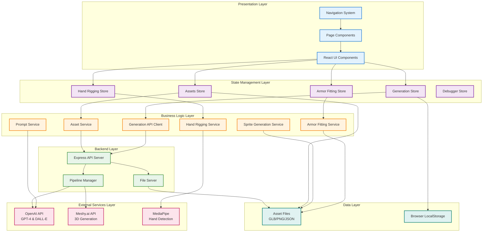
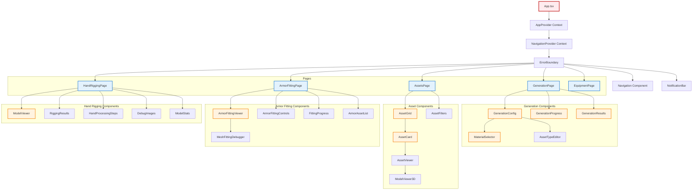
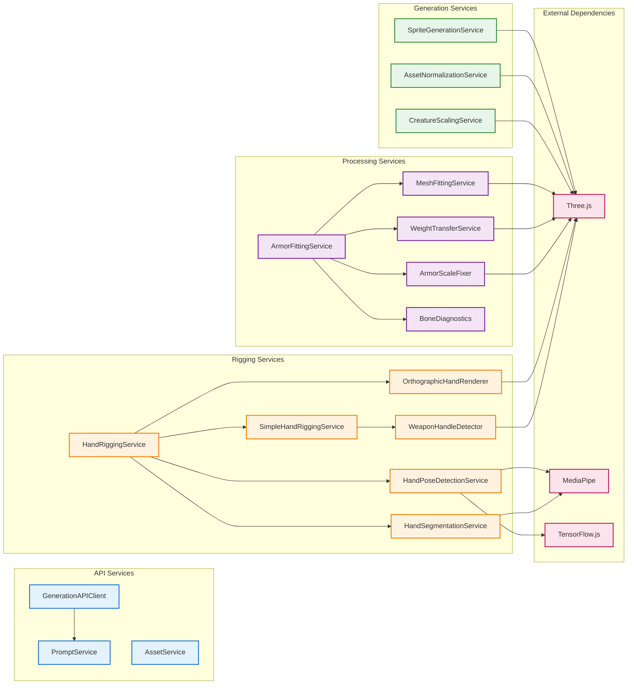
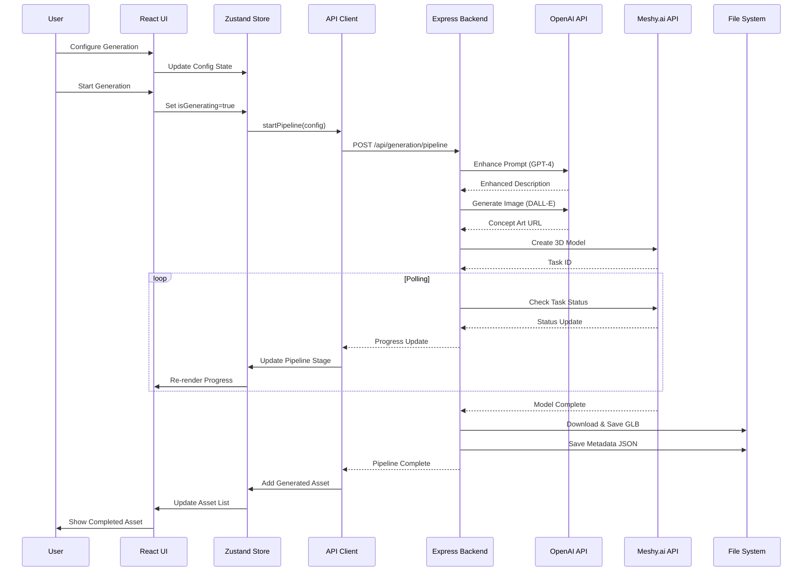
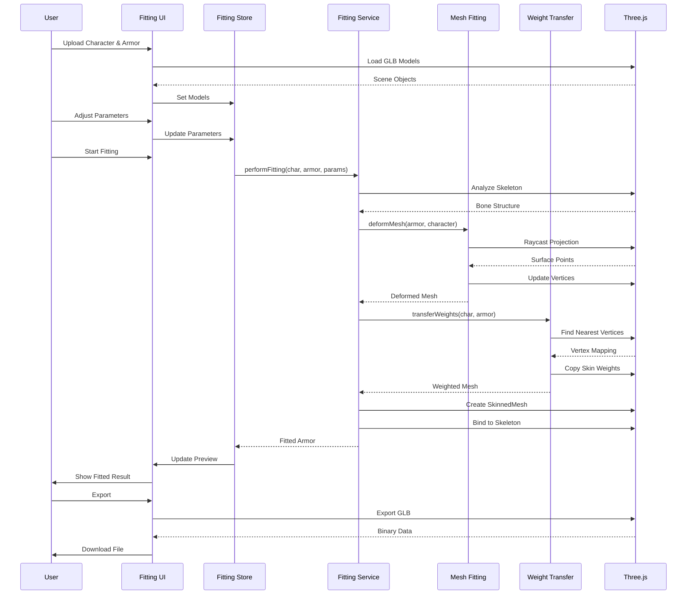
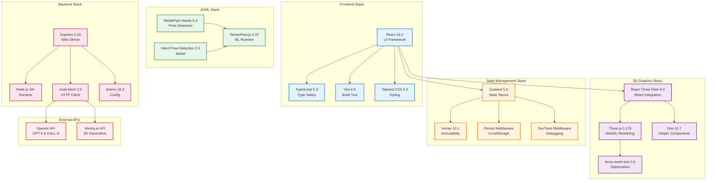
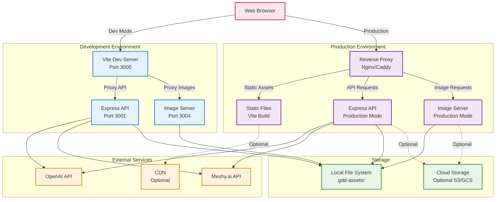
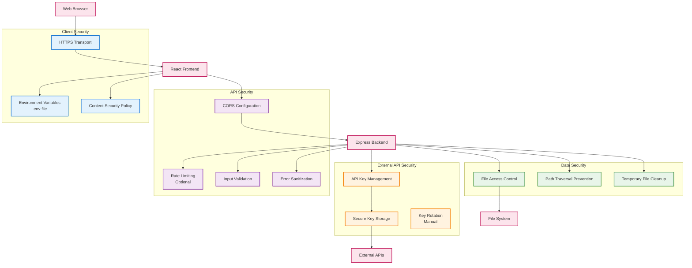
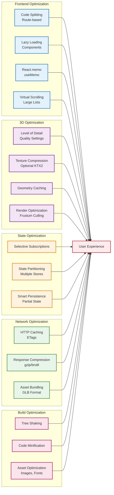

# Architecture Overview

This document provides comprehensive architectural diagrams illustrating the structure, layers, and component relationships within Asset Forge.

## System Architecture Layers

Asset Forge follows a layered architecture pattern with clear separation of concerns:



## Frontend Architecture

### Component Hierarchy



### Service Layer Architecture



## Backend Architecture

### API Server Structure

```mermaid
graph TB
    Client[React Frontend]

    subgraph "Express API Server"
        Router[API Router]

        subgraph "Endpoints"
            AssetsAPI[/api/assets/*]
            GenAPI[/api/generation/*]
            RetexAPI[/api/retexture/*]
            FittingAPI[/api/fitting/*]
            RiggingAPI[/api/hand-rigging/*]
        end

        subgraph "Middleware"
            CORS[CORS Middleware]
            JSON[JSON Parser]
            ErrorHandler[Error Handler]
        end

        subgraph "Services"
            PipelineMgr[Pipeline Manager]
            FileHandler[File Handler]
            ImageServer[Image Server]
        end
    end

    subgraph "External APIs"
        OpenAIAPI[OpenAI API]
        MeshyAPI[Meshy.ai API]
    end

    subgraph "File System"
        AssetDir[gdd-assets/]
        TempDir[temp/]
    end

    Client -->|HTTP Request| Router
    Router --> CORS
    CORS --> JSON
    JSON --> AssetsAPI
    JSON --> GenAPI
    JSON --> RetexAPI
    JSON --> FittingAPI
    JSON --> RiggingAPI

    AssetsAPI --> FileHandler
    GenAPI --> PipelineMgr
    RetexAPI --> PipelineMgr

    PipelineMgr --> OpenAIAPI
    PipelineMgr --> MeshyAPI

    FileHandler --> AssetDir
    PipelineMgr --> AssetDir
    PipelineMgr --> TempDir
    ImageServer --> AssetDir

    ErrorHandler --> Client

    classDef client fill:#e3f2fd,stroke:#1976d2,stroke-width:2px
    classDef server fill:#f3e5f5,stroke:#7b1fa2,stroke-width:2px
    classDef endpoint fill:#fff3e0,stroke:#f57c00,stroke-width:2px
    classDef middleware fill:#e8f5e9,stroke:#388e3c,stroke-width:2px
    classDef service fill:#fce4ec,stroke:#c2185b,stroke-width:2px
    classDef external fill:#ffebee,stroke:#c62828,stroke-width:2px
    classDef storage fill:#e0f2f1,stroke:#00796b,stroke-width:2px

    class Client client
    class Router server
    class AssetsAPI,GenAPI,RetexAPI,FittingAPI,RiggingAPI endpoint
    class CORS,JSON,ErrorHandler middleware
    class PipelineMgr,FileHandler,ImageServer service
    class OpenAIAPI,MeshyAPI external
    class AssetDir,TempDir storage
```

## Data Flow Architecture

### Asset Generation Data Flow



### Armor Fitting Data Flow



## Technology Stack Integration



## Deployment Architecture



## Security Architecture



## Performance Optimization Architecture



---

## Architecture Principles

### Separation of Concerns
- **Presentation Layer**: Handles UI rendering and user interactions
- **State Management Layer**: Manages application state with Zustand
- **Business Logic Layer**: Implements core functionality in services
- **Backend Layer**: Provides APIs and orchestrates external services
- **Data Layer**: Persists assets and configuration

### Modularity
- Services are self-contained and focused on specific responsibilities
- Components are composable and reusable
- Stores are domain-specific (generation, assets, fitting, rigging)
- Clear interfaces between layers

### Scalability
- Asynchronous operations for non-blocking UX
- Lazy loading reduces initial bundle size
- State partitioning prevents bottlenecks
- File-based storage scales horizontally

### Maintainability
- TypeScript provides type safety and documentation
- Consistent naming conventions and folder structure
- Comprehensive error handling
- Extensive logging for debugging

### Extensibility
- Plugin-ready architecture for future extensions
- Abstract interfaces for swappable implementations
- Configuration-driven behavior
- Event-based communication for loose coupling

---

This architectural overview provides a comprehensive understanding of Asset Forge's structure, dependencies, and design patterns. For detailed information about specific components, refer to the relevant sections of the documentation.
