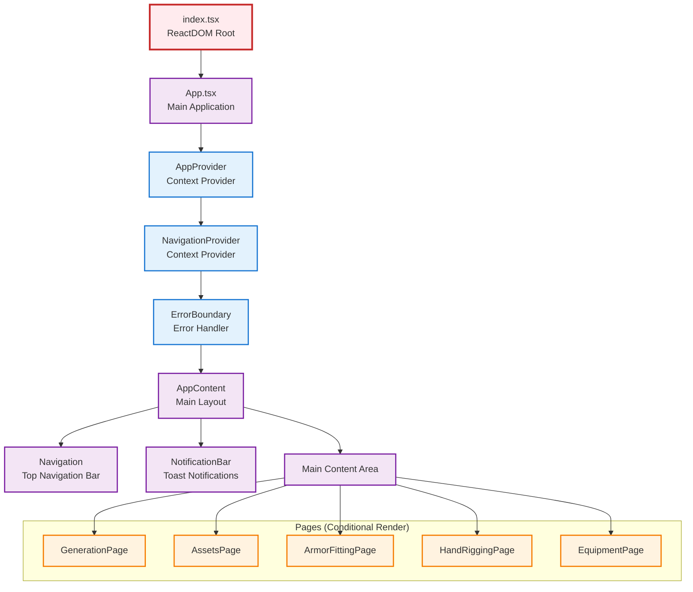
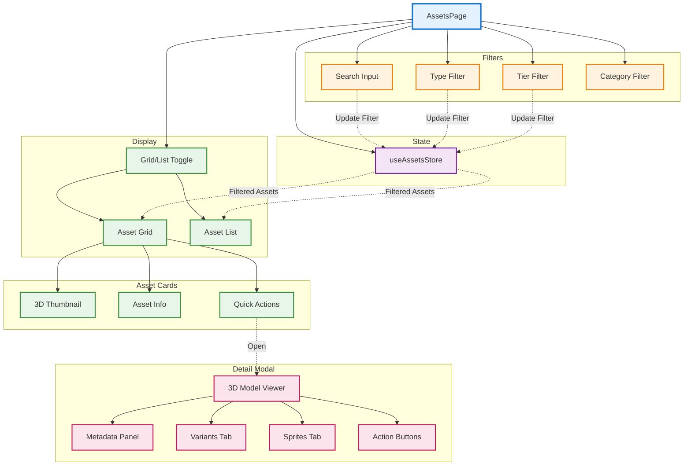
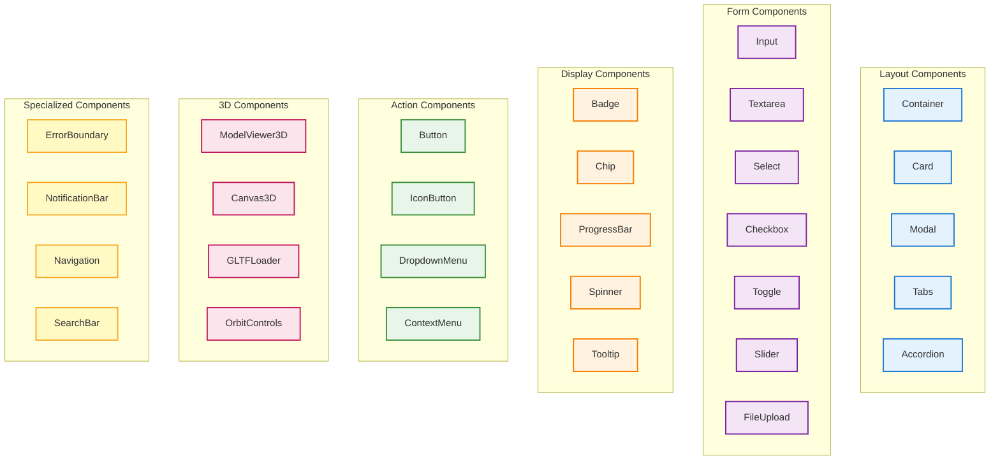
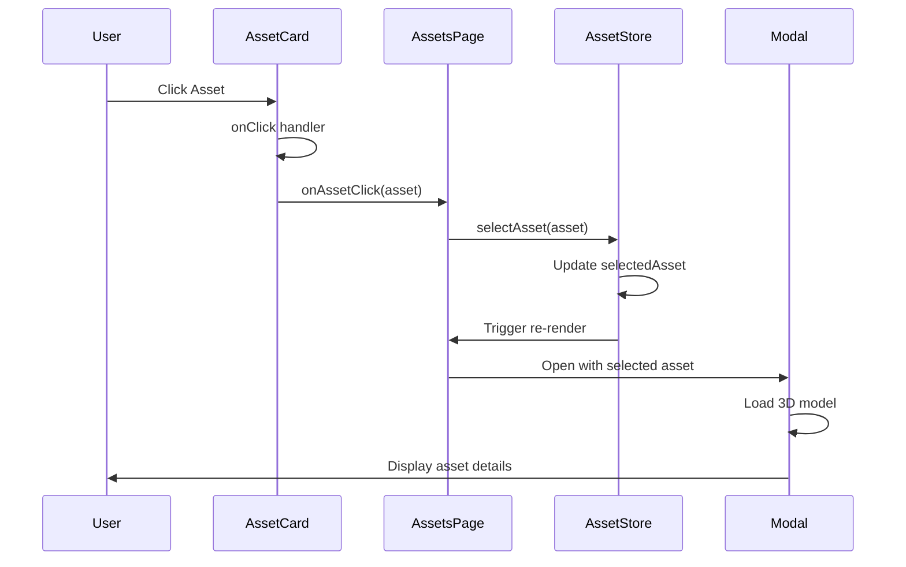
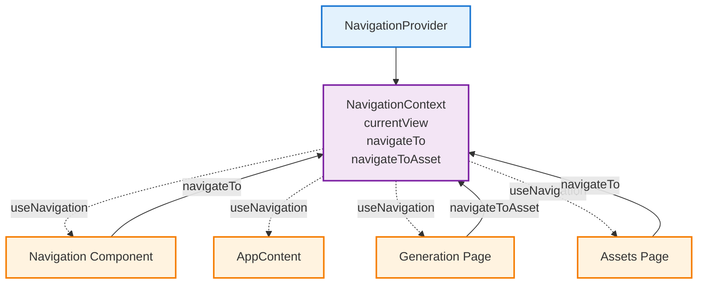

# Component Hierarchy and Architecture

This document provides comprehensive component trees, prop flows, and context usage patterns for Asset Forge's React component architecture.

## Application Root Hierarchy



## Generation Page Component Tree

### Complete Component Hierarchy

```
GenerationPage
├── Container (div.max-w-7xl)
│   ├── Header
│   │   └── Title + Description
│   │
│   ├── ViewSelector
│   │   ├── ConfigButton
│   │   ├── ProgressButton
│   │   └── ResultsButton
│   │
│   ├── ConfigView (if activeView === 'config')
│   │   ├── GenerationTypeSelector
│   │   │   ├── ItemTypeCard
│   │   │   └── AvatarTypeCard
│   │   │
│   │   ├── GenerationConfig (if type selected)
│   │   │   ├── BasicInfoSection
│   │   │   │   ├── AssetNameInput
│   │   │   │   ├── AssetTypeSelect
│   │   │   │   │   └── AssetTypeEditor (modal)
│   │   │   │   └── DescriptionTextarea
│   │   │   │
│   │   │   ├── StyleSection
│   │   │   │   ├── GameStyleSelector
│   │   │   │   ├── CustomStyleInput
│   │   │   │   └── AdvancedPromptsToggle
│   │   │   │       └── AdvancedPromptsEditor (modal)
│   │   │   │
│   │   │   ├── ReferenceImageSection
│   │   │   │   ├── AutoImageToggle
│   │   │   │   └── CustomImageUpload
│   │   │   │       ├── UploadButton
│   │   │   │       ├── URLInput
│   │   │   │       └── ImagePreview
│   │   │   │
│   │   │   ├── QualitySection
│   │   │   │   └── QualitySelector
│   │   │   │       ├── StandardOption
│   │   │   │       ├── HighOption
│   │   │   │       └── UltraOption
│   │   │   │
│   │   │   ├── MaterialVariantsSection (if type === 'item')
│   │   │   │   ├── EnableRetexturingToggle
│   │   │   │   ├── MaterialPresetGrid
│   │   │   │   │   └── MaterialChip (multiple)
│   │   │   │   ├── CustomMaterialButton
│   │   │   │   │   └── CustomMaterialModal
│   │   │   │   └── EditPromptsToggle
│   │   │   │       └── PromptEditor (modal)
│   │   │   │
│   │   │   ├── RiggingSection (if type === 'avatar')
│   │   │   │   ├── EnableRiggingToggle
│   │   │   │   └── CharacterHeightInput
│   │   │   │
│   │   │   ├── SpriteSection
│   │   │   │   ├── EnableSpritesToggle
│   │   │   │   └── SpriteConfigOptions
│   │   │   │       ├── AngleCountInput
│   │   │   │       └── ResolutionSelect
│   │   │   │
│   │   │   └── GenerateButton
│   │   │
│   │   └── ConfigSummary
│   │       └── EstimatedCost
│   │
│   ├── ProgressView (if activeView === 'progress')
│   │   ├── GenerationProgress
│   │   │   ├── PipelineStageList
│   │   │   │   └── PipelineStage (multiple)
│   │   │   │       ├── StageIcon
│   │   │   │       ├── StageName
│   │   │   │       ├── StageDescription
│   │   │   │       └── StageStatusBadge
│   │   │   │
│   │   │   ├── CurrentStageDetails
│   │   │   │   ├── StageProgressBar
│   │   │   │   ├── StageMessage
│   │   │   │   └── ElapsedTime
│   │   │   │
│   │   │   └── CancelButton
│   │   │
│   │   └── StageResultPreview (optional)
│   │       ├── ConceptArtPreview
│   │       └── ModelPreview
│   │
│   └── ResultsView (if activeView === 'results')
│       ├── GenerationResults
│       │   ├── ResultsHeader
│       │   │   ├── SuccessMessage
│       │   │   └── ActionButtons
│       │   │       ├── ViewInLibraryButton
│       │   │       └── GenerateAnotherButton
│       │   │
│       │   ├── AssetDisplay
│       │   │   ├── ConceptArtDisplay
│       │   │   │   └── Image
│       │   │   │
│       │   │   ├── ModelViewer3D
│       │   │   │   ├── Canvas (R3F)
│       │   │   │   │   ├── Scene
│       │   │   │   │   ├── PerspectiveCamera
│       │   │   │   │   ├── OrbitControls
│       │   │   │   │   ├── Lights
│       │   │   │   │   └── GLTFModel
│       │   │   │   │
│       │   │   │   └── ViewportControls
│       │   │   │       ├── RotateButton
│       │   │   │       ├── ResetViewButton
│       │   │   │       └── FullscreenButton
│       │   │   │
│       │   │   └── AssetMetadata
│       │   │       ├── Name
│       │   │       ├── Type
│       │   │       ├── Tier
│       │   │       ├── GenerationMethod
│       │   │       └── CreatedAt
│       │   │
│       │   ├── VariantsSection (if variants exist)
│       │   │   ├── VariantGrid
│       │   │   │   └── VariantCard (multiple)
│       │   │   │       ├── VariantPreview
│       │   │   │       ├── VariantName
│       │   │   │       └── SelectButton
│       │   │   │
│       │   │   └── SelectedVariantViewer
│       │   │       └── ModelViewer3D
│       │   │
│       │   ├── SpritesSection (if sprites exist)
│       │   │   ├── SpriteGrid
│       │   │   │   └── SpriteImage (multiple)
│       │   │   │
│       │   │   └── DownloadAllButton
│       │   │
│       │   └── ExportSection
│       │       ├── DownloadGLBButton
│       │       ├── DownloadConceptArtButton
│       │       └── DownloadMetadataButton
│       │
│       └── GenerationLog (collapsible)
│           └── StageTimings
```

### Mermaid Diagram: Generation Page

```mermaid
graph TB
    GenPage[GenerationPage]

    subgraph "State Management"
        GenStore[useGenerationStore]
    end

    subgraph "View Router"
        ViewSelector[View Selector Tabs]
        ConfigView[Config View]
        ProgressView[Progress View]
        ResultsView[Results View]
    end

    subgraph "Config Components"
        TypeSelector[Generation Type Selector]
        BasicInfo[Basic Info Form]
        StyleConfig[Style Configuration]
        QualitySelect[Quality Selector]
        MaterialConfig[Material Variants Config]
        RiggingConfig[Rigging Options]
        SpriteConfig[Sprite Options]
        GenButton[Generate Button]
    end

    subgraph "Progress Components"
        StageList[Pipeline Stage List]
        StageProgress[Current Stage Progress]
        StagePreview[Stage Result Preview]
    end

    subgraph "Results Components"
        ConceptArt[Concept Art Display]
        Model3D[3D Model Viewer]
        VariantList[Variant Grid]
        SpriteList[Sprite Grid]
        ExportButtons[Export Actions]
    end

    GenPage --> GenStore
    GenPage --> ViewSelector

    ViewSelector --> ConfigView
    ViewSelector --> ProgressView
    ViewSelector --> ResultsView

    ConfigView --> TypeSelector
    ConfigView --> BasicInfo
    ConfigView --> StyleConfig
    ConfigView --> QualitySelect
    ConfigView --> MaterialConfig
    ConfigView --> RiggingConfig
    ConfigView --> SpriteConfig
    ConfigView --> GenButton

    ProgressView --> StageList
    ProgressView --> StageProgress
    ProgressView --> StagePreview

    ResultsView --> ConceptArt
    ResultsView --> Model3D
    ResultsView --> VariantList
    ResultsView --> SpriteList
    ResultsView --> ExportButtons

    GenStore -.->|State| ConfigView
    GenStore -.->|State| ProgressView
    GenStore -.->|State| ResultsView

    classDef page fill:#e3f2fd,stroke:#1976d2,stroke-width:3px
    classDef state fill:#f3e5f5,stroke:#7b1fa2,stroke-width:2px
    classDef view fill:#fff3e0,stroke:#f57c00,stroke-width:2px
    classDef component fill:#e8f5e9,stroke:#388e3c,stroke-width:2px

    class GenPage page
    class GenStore state
    class ViewSelector,ConfigView,ProgressView,ResultsView view
    class TypeSelector,BasicInfo,StyleConfig,QualitySelect,MaterialConfig,RiggingConfig,SpriteConfig,GenButton,StageList,StageProgress,StagePreview,ConceptArt,Model3D,VariantList,SpriteList,ExportButtons component
```



## Assets Page Component Tree

```
AssetsPage
├── Container
│   ├── Header
│   │   ├── Title
│   │   └── AssetCounter
│   │
│   ├── FiltersBar
│   │   ├── SearchInput
│   │   │   ├── SearchIcon
│   │   │   └── ClearButton
│   │   │
│   │   ├── TypeFilter
│   │   │   └── TypeDropdown
│   │   │       └── TypeOption (multiple)
│   │   │
│   │   ├── TierFilter
│   │   │   └── TierDropdown
│   │   │       └── TierOption (multiple)
│   │   │
│   │   ├── CategoryFilter
│   │   │   └── CategoryDropdown
│   │   │
│   │   └── ClearFiltersButton
│   │
│   ├── ViewModeToggle
│   │   ├── GridViewButton
│   │   └── ListViewButton
│   │
│   ├── AssetGrid (if viewMode === 'grid')
│   │   └── AssetCard (multiple)
│   │       ├── ModelThumbnail
│   │       │   └── Canvas3D (mini viewer)
│   │       │
│   │       ├── AssetInfo
│   │       │   ├── AssetName
│   │       │   ├── AssetType
│   │       │   └── AssetTier
│   │       │
│   │       ├── QuickActions
│   │       │   ├── ViewButton
│   │       │   ├── DownloadButton
│   │       │   └── DeleteButton
│   │       │
│   │       └── VariantIndicator (if has variants)
│   │
│   ├── AssetList (if viewMode === 'list')
│   │   └── AssetRow (multiple)
│   │       ├── Thumbnail
│   │       ├── Name
│   │       ├── Type
│   │       ├── Tier
│   │       ├── CreatedDate
│   │       └── Actions
│   │
│   ├── AssetDetailModal (when asset selected)
│   │   ├── ModalHeader
│   │   │   ├── AssetName
│   │   │   └── CloseButton
│   │   │
│   │   ├── MainViewer
│   │   │   ├── ModelViewer3D
│   │   │   │   ├── Canvas (R3F)
│   │   │   │   └── Controls
│   │   │   │
│   │   │   └── ConceptArtToggle
│   │   │       └── ConceptArtImage
│   │   │
│   │   ├── MetadataPanel
│   │   │   ├── GeneralInfo
│   │   │   ├── GenerationDetails
│   │   │   ├── TechnicalSpecs
│   │   │   └── Timestamps
│   │   │
│   │   ├── VariantsTab (if variants)
│   │   │   └── VariantGrid
│   │   │       └── VariantCard (multiple)
│   │   │
│   │   ├── SpritesTab (if sprites)
│   │   │   └── SpriteGallery
│   │   │       └── SpriteImage (multiple)
│   │   │
│   │   └── ActionsFooter
│   │       ├── DownloadButton
│   │       ├── RegenerateButton
│   │       ├── FitArmorButton (if armor)
│   │       ├── RigWeaponButton (if weapon)
│   │       └── DeleteButton
│   │
│   ├── EmptyState (if no assets)
│   │   ├── EmptyIcon
│   │   ├── EmptyMessage
│   │   └── GenerateFirstButton
│   │
│   └── LoadingState (while loading)
│       └── Spinner
```

### Mermaid Diagram: Assets Page



## Armor Fitting Page Component Tree

```
ArmorFittingPage
├── Container
│   ├── Header
│   │   ├── Title
│   │   └── Description
│   │
│   ├── SplitLayout
│   │   ├── LeftPanel (30%)
│   │   │   ├── ModelSelection
│   │   │   │   ├── CharacterSection
│   │   │   │   │   ├── SectionTitle
│   │   │   │   │   ├── AvatarList
│   │   │   │   │   │   └── AvatarCard (multiple)
│   │   │   │   │   │       ├── AvatarThumbnail
│   │   │   │   │   │       ├── AvatarName
│   │   │   │   │   │       └── SelectButton
│   │   │   │   │   │
│   │   │   │   │   └── UploadCharacterButton
│   │   │   │   │       └── FileInput
│   │   │   │   │
│   │   │   │   └── ArmorSection
│   │   │   │       ├── SectionTitle
│   │   │   │       ├── ArmorAssetList
│   │   │   │       │   └── ArmorCard (multiple)
│   │   │   │       │       ├── ArmorThumbnail
│   │   │   │       │       ├── ArmorName
│   │   │   │       │       ├── ArmorType (helmet/chest/etc)
│   │   │   │       │       └── SelectButton
│   │   │   │       │
│   │   │   │       └── UploadArmorButton
│   │   │   │           └── FileInput
│   │   │   │
│   │   │   ├── FittingParameters
│   │   │   │   ├── OffsetSlider
│   │   │   │   │   ├── Label
│   │   │   │   │   ├── RangeInput
│   │   │   │   │   └── Value Display
│   │   │   │   │
│   │   │   │   ├── SampleDensitySlider
│   │   │   │   ├── SmoothingSlider
│   │   │   │   └── MethodSelector
│   │   │   │       ├── ShrinkwrapOption
│   │   │   │       └── ClosestPointOption
│   │   │   │
│   │   │   └── Actions
│   │   │       ├── FitArmorButton
│   │   │       ├── ResetButton
│   │   │       └── ExportButton
│   │   │
│   │   └── RightPanel (70%)
│   │       ├── ViewportToolbar
│   │       │   ├── ShowHullToggle
│   │       │   ├── ShowDebugToggle
│   │       │   ├── ShowSkeletonToggle
│   │       │   └── ResetCameraButton
│   │       │
│   │       ├── Scene3D
│   │       │   ├── Canvas (R3F)
│   │       │   │   ├── Scene
│   │       │   │   ├── PerspectiveCamera
│   │       │   │   ├── OrbitControls
│   │       │   │   │
│   │       │   │   ├── Lights
│   │       │   │   │   ├── AmbientLight
│   │       │   │   │   ├── DirectionalLight (x3)
│   │       │   │   │   └── HemisphereLight
│   │       │   │   │
│   │       │   │   ├── CharacterModel (if loaded)
│   │       │   │   │   └── SkinnedMesh
│   │       │   │   │       └── Skeleton
│   │       │   │   │
│   │       │   │   ├── ArmorModel (if loaded)
│   │       │   │   │   └── Mesh/SkinnedMesh
│   │       │   │   │
│   │       │   │   ├── FittedArmorModel (if fitted)
│   │       │   │   │   └── SkinnedMesh
│   │       │   │   │       └── Skeleton (reference)
│   │       │   │   │
│   │       │   │   ├── ConvexHull (if showHull)
│   │       │   │   │   └── LineSegments
│   │       │   │   │
│   │       │   │   ├── DebugArrows (if showDebug)
│   │       │   │   │   └── ArrowHelper (multiple)
│   │       │   │   │
│   │       │   │   ├── SkeletonHelper (if showSkeleton)
│   │       │   │   │
│   │       │   │   ├── GridHelper
│   │       │   │   └── AxesHelper
│   │       │   │
│   │       │   └── LoadingOverlay (while processing)
│   │       │
│   │       └── StatusBar
│   │           ├── ProcessingIndicator
│   │           ├── ErrorMessage (if error)
│   │           └── SuccessMessage (if fitted)
│   │
│   └── HelpPanel (collapsible)
│       ├── QuickStartGuide
│       ├── ParameterExplanations
│       └── TroubleshootingTips
```

## Hand Rigging Page Component Tree

```
HandRiggingPage
├── Container
│   ├── Header
│   │   ├── Title
│   │   └── Description
│   │
│   ├── SplitLayout
│   │   ├── LeftPanel (35%)
│   │   │   ├── WeaponUpload
│   │   │   │   ├── UploadButton
│   │   │   │   │   └── FileInput
│   │   │   │   │
│   │   │   │   └── RecentWeapons
│   │   │   │       └── WeaponCard (multiple)
│   │   │   │
│   │   │   ├── HandConfiguration
│   │   │   │   ├── HandSelector
│   │   │   │   │   ├── LeftHandOption
│   │   │   │   │   └── RightHandOption
│   │   │   │   │
│   │   │   │   └── HandAvatarSelector
│   │   │   │       ├── AvatarPreview
│   │   │   │       └── AvatarDropdown
│   │   │   │
│   │   │   ├── ProcessingSteps
│   │   │   │   └── StepIndicator (multiple)
│   │   │   │       ├── StepNumber
│   │   │   │       ├── StepName
│   │   │   │       └── StepStatus
│   │   │   │
│   │   │   ├── Actions
│   │   │   │   ├── StartRiggingButton
│   │   │   │   ├── ResetButton
│   │   │   │   └── ExportButton (if complete)
│   │   │   │
│   │   │   └── RiggingResults (if complete)
│   │   │       ├── GripPointDisplay
│   │   │       │   ├── Position (x,y,z)
│   │   │       │   ├── Rotation (euler)
│   │   │       │   └── Confidence
│   │   │       │
│   │   │       └── DetectionQuality
│   │   │           ├── QualityScore
│   │   │           └── Recommendations
│   │   │
│   │   └── RightPanel (65%)
│   │       ├── ViewTabs
│   │       │   ├── ModelViewTab
│   │       │   └── DebugViewTab
│   │       │
│   │       ├── ModelView (if ModelViewTab active)
│   │       │   ├── ViewportControls
│   │       │   │   ├── ShowGripPointToggle
│   │       │   │   ├── ShowHandToggle
│   │       │   │   └── ResetCameraButton
│   │       │   │
│   │       │   ├── Canvas3D (R3F)
│   │       │   │   ├── Scene
│   │       │   │   ├── PerspectiveCamera
│   │       │   │   ├── OrbitControls
│   │       │   │   ├── Lights
│   │       │   │   │
│   │       │   │   ├── WeaponModel
│   │       │   │   │   └── GLTFModel
│   │       │   │   │
│   │       │   │   ├── HandleHighlight (if detected)
│   │       │   │   │   └── CylinderMesh (wireframe)
│   │       │   │   │
│   │       │   │   ├── GripPointMarker (if calculated)
│   │       │   │   │   └── SphereMarker
│   │       │   │   │       └── AxesHelper
│   │       │   │   │
│   │       │   │   ├── HandModel (if showHand)
│   │       │   │   │   └── HandMesh
│   │       │   │   │       └── FingerBones
│   │       │   │   │
│   │       │   │   └── GridHelper
│   │       │   │
│   │       │   └── ModelStats
│   │       │       ├── VertexCount
│   │       │       ├── TriangleCount
│   │       │       └── BoundingBox
│   │       │
│   │       └── DebugView (if DebugViewTab active)
│   │           ├── DebugImages
│   │           │   ├── FrontView
│   │           │   │   ├── OrthographicRender
│   │           │   │   └── HandLandmarks (overlay)
│   │           │   │
│   │           │   ├── SideView
│   │           │   │   ├── OrthographicRender
│   │           │   │   └── HandLandmarks (overlay)
│   │           │   │
│   │           │   └── TopView
│   │           │       ├── OrthographicRender
│   │           │       └── HandLandmarks (overlay)
│   │           │
│   │           └── DebugLogs
│   │               └── LogEntry (multiple)
│   │
│   └── HelpSection (collapsible)
│       ├── ProcessOverview
│       ├── BestPractices
│       └── CommonIssues
```

## Shared Component Library

### Common Components



## Prop Flow Examples

### Generation Config Prop Flow

```mermaid
graph LR
    Store[Generation Store]
    Page[Generation Page]
    ConfigView[Config View]
    BasicInfo[Basic Info Form]
    NameInput[Name Input]

    Store -->|State| Page
    Page -->|activeView| ConfigView
    ConfigView -->|assetName| BasicInfo
    BasicInfo -->|value| NameInput

    NameInput -.->|onChange| BasicInfo
    BasicInfo -.->|setAssetName| ConfigView
    ConfigView -.->|action| Page
    Page -.->|update| Store

    classDef store fill:#e3f2fd,stroke:#1976d2,stroke-width:2px
    classDef component fill:#f3e5f5,stroke:#7b1fa2,stroke-width:2px
    classDef input fill:#fff3e0,stroke:#f57c00,stroke-width:2px

    class Store store
    class Page,ConfigView,BasicInfo component
    class NameInput input
```



### Asset Card Click Flow



## Context Usage Patterns

### Navigation Context



---

## Component Design Patterns

### 1. Container/Presentational Pattern
- **Containers**: Connect to stores, manage logic (Pages)
- **Presentational**: Receive props, render UI (Components)

### 2. Compound Components
- Navigation with NavItem children
- Tabs with TabPanel children
- Accordion with AccordionItem children

### 3. Render Props
- ErrorBoundary with fallback render
- Modal with children render function

### 4. Higher-Order Components
- withErrorBoundary wrapper
- withLoadingState wrapper

### 5. Custom Hooks Pattern
- useNavigation for routing
- useThreeScene for 3D setup
- useAssetActions for asset operations
- useMaterialPresets for material loading

---

This comprehensive component hierarchy documentation provides deep understanding of Asset Forge's React architecture, component relationships, and data flow patterns. For implementation details, refer to the `/src/components/` and `/src/pages/` directories.
