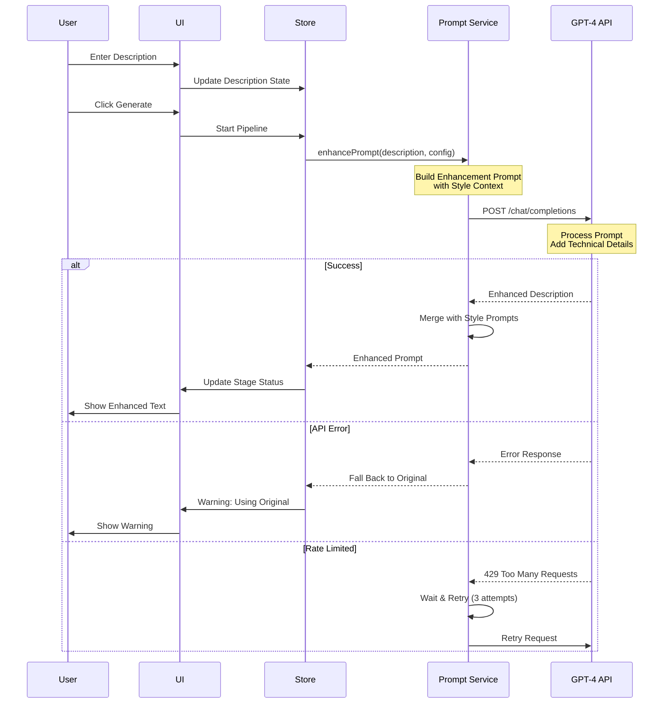
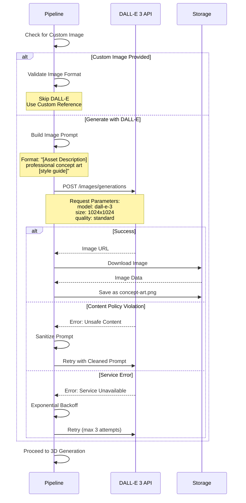
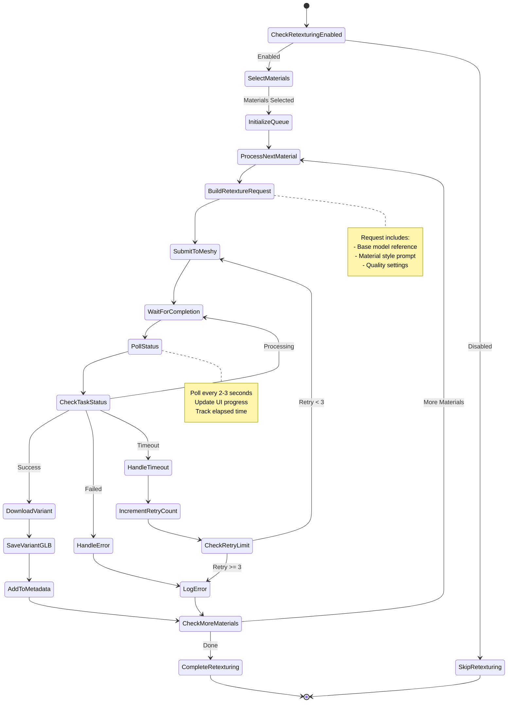
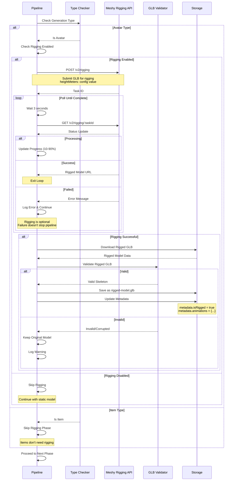
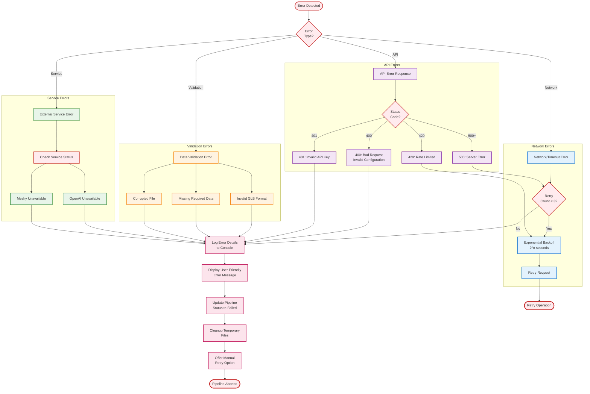
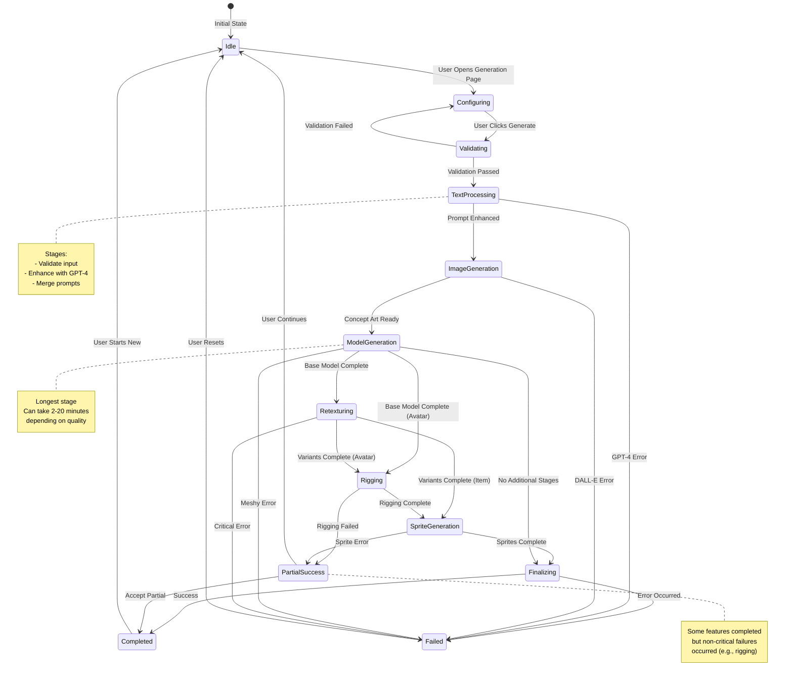
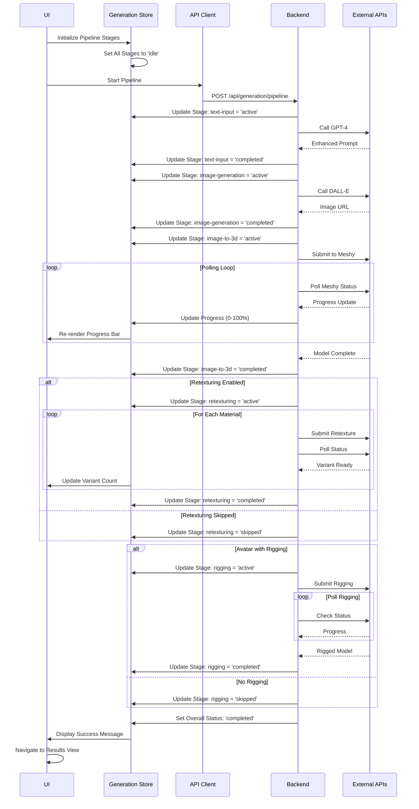

# Generation Pipeline Flowcharts

This document provides comprehensive flowcharts and sequence diagrams illustrating the Asset Forge generation pipeline, from initial user input to completed 3D assets.

## Pipeline Overview

### Complete Generation Pipeline

```mermaid
graph TB
    Start([User Starts Generation])

    subgraph "Configuration Phase"
        Input[User Input<br/>Name, Type, Description]
        Config[Configure Options<br/>Quality, Materials, Sprites]
        Validate{Configuration<br/>Valid?}
    end

    subgraph "Text Processing Phase"
        GPT4Check{GPT-4<br/>Enhancement<br/>Enabled?}
        EnhancePrompt[Enhance Prompt<br/>with GPT-4]
        UseOriginal[Use Original<br/>Description]
        MergePrompt[Merge with<br/>Style Prompts]
    end

    subgraph "Image Generation Phase"
        CustomImage{Custom<br/>Reference<br/>Image?}
        GenerateImage[Generate Concept Art<br/>DALL-E 3]
        UseCustom[Use Custom Image]
        ImageReady[Concept Art Ready]
    end

    subgraph "3D Generation Phase"
        Submit3D[Submit to Meshy<br/>Image-to-3D]
        Poll3D[Poll Meshy Status<br/>Every 2-3 seconds]
        Check3D{Status?}
        Download3D[Download GLB Model]
        Save3D[Save to File System]
    end

    subgraph "Retexturing Phase"
        RetexCheck{Retexturing<br/>Enabled?}
        ForEachMaterial[For Each Material<br/>Variant]
        SubmitRetex[Submit Retexture<br/>Request to Meshy]
        PollRetex[Poll Retexture<br/>Status]
        CheckRetex{Status?}
        DownloadRetex[Download Variant<br/>GLB]
        SaveRetex[Save Variant]
        NextMaterial{More<br/>Materials?}
    end

    subgraph "Rigging Phase"
        RigCheck{Avatar +<br/>Rigging<br/>Enabled?}
        SubmitRig[Submit Auto-Rigging<br/>Request to Meshy]
        PollRig[Poll Rigging<br/>Status]
        CheckRig{Status?}
        DownloadRig[Download Rigged<br/>Model]
        SaveRig[Save Rigged Model]
    end

    subgraph "Sprite Generation Phase"
        SpriteCheck{Sprite<br/>Generation<br/>Enabled?}
        RenderAngles[Render Model<br/>at Multiple Angles]
        CaptureFrames[Capture PNG<br/>Screenshots]
        SaveSprites[Save Sprite<br/>Images]
    end

    subgraph "Finalization Phase"
        CreateMeta[Create Metadata<br/>JSON File]
        UpdateLibrary[Update Asset<br/>Library]
        NotifyUser[Notify User<br/>Generation Complete]
    end

    Complete([Pipeline Complete])
    Error([Error Handler])

    Start --> Input
    Input --> Config
    Config --> Validate
    Validate -->|Invalid| Input
    Validate -->|Valid| GPT4Check

    GPT4Check -->|Yes| EnhancePrompt
    GPT4Check -->|No| UseOriginal
    EnhancePrompt --> MergePrompt
    UseOriginal --> MergePrompt

    MergePrompt --> CustomImage
    CustomImage -->|No| GenerateImage
    CustomImage -->|Yes| UseCustom
    GenerateImage --> ImageReady
    UseCustom --> ImageReady

    ImageReady --> Submit3D
    Submit3D --> Poll3D
    Poll3D --> Check3D
    Check3D -->|Processing| Poll3D
    Check3D -->|Success| Download3D
    Check3D -->|Failed| Error
    Check3D -->|Timeout| Error
    Download3D --> Save3D

    Save3D --> RetexCheck
    RetexCheck -->|No| RigCheck
    RetexCheck -->|Yes| ForEachMaterial
    ForEachMaterial --> SubmitRetex
    SubmitRetex --> PollRetex
    PollRetex --> CheckRetex
    CheckRetex -->|Processing| PollRetex
    CheckRetex -->|Success| DownloadRetex
    CheckRetex -->|Failed| Error
    DownloadRetex --> SaveRetex
    SaveRetex --> NextMaterial
    NextMaterial -->|Yes| ForEachMaterial
    NextMaterial -->|No| RigCheck

    RigCheck -->|No| SpriteCheck
    RigCheck -->|Yes| SubmitRig
    SubmitRig --> PollRig
    PollRig --> CheckRig
    CheckRig -->|Processing| PollRig
    CheckRig -->|Success| DownloadRig
    CheckRig -->|Failed| Error
    DownloadRig --> SaveRig
    SaveRig --> SpriteCheck

    SpriteCheck -->|No| CreateMeta
    SpriteCheck -->|Yes| RenderAngles
    RenderAngles --> CaptureFrames
    CaptureFrames --> SaveSprites
    SaveSprites --> CreateMeta

    CreateMeta --> UpdateLibrary
    UpdateLibrary --> NotifyUser
    NotifyUser --> Complete

    Error --> NotifyUser

    classDef config fill:#e3f2fd,stroke:#1976d2,stroke-width:2px
    classDef text fill:#f3e5f5,stroke:#7b1fa2,stroke-width:2px
    classDef image fill:#fff3e0,stroke:#f57c00,stroke-width:2px
    classDef model fill:#e8f5e9,stroke:#388e3c,stroke-width:2px
    classDef retex fill:#fce4ec,stroke:#c2185b,stroke-width:2px
    classDef rig fill:#e1f5fe,stroke:#0277bd,stroke-width:2px
    classDef sprite fill:#f1f8e9,stroke:#558b2f,stroke-width:2px
    classDef final fill:#fce4ec,stroke:#880e4f,stroke-width:2px
    classDef decision fill:#fff9c4,stroke:#f9a825,stroke-width:2px
    classDef endpoint fill:#ffebee,stroke:#c62828,stroke-width:3px

    class Input,Config,Validate config
    class GPT4Check,EnhancePrompt,UseOriginal,MergePrompt text
    class CustomImage,GenerateImage,UseCustom,ImageReady image
    class Submit3D,Poll3D,Check3D,Download3D,Save3D model
    class RetexCheck,ForEachMaterial,SubmitRetex,PollRetex,CheckRetex,DownloadRetex,SaveRetex,NextMaterial retex
    class RigCheck,SubmitRig,PollRig,CheckRig,DownloadRig,SaveRig rig
    class SpriteCheck,RenderAngles,CaptureFrames,SaveSprites sprite
    class CreateMeta,UpdateLibrary,NotifyUser final
    class Validate,GPT4Check,CustomImage,Check3D,RetexCheck,CheckRetex,NextMaterial,RigCheck,CheckRig,SpriteCheck decision
    class Start,Complete,Error endpoint
```



## Detailed Phase Diagrams

### Phase 1: Prompt Enhancement



### Phase 2: Concept Art Generation



### Phase 3: 3D Model Generation

```mermaid
flowchart TB
    Start([Start 3D Generation])

    PrepareRequest[Prepare Meshy Request<br/>Image URL + Prompts]
    Submit[POST /v2/image-to-3d]
    GetTaskID[Receive Task ID]

    subgraph "Polling Loop"
        Wait[Wait 2-3 Seconds]
        Poll[GET /v2/image-to-3d/:taskId]
        CheckStatus{Task Status?}
    end

    ProcessingState[Status: Processing<br/>Update Progress Bar]
    SuccessState[Status: Success<br/>Model URL Available]
    FailedState[Status: Failed<br/>Error Message]

    DownloadModel[Download GLB<br/>from Model URL]
    ValidateGLB{Valid GLB<br/>Format?}
    SaveModel[Save to<br/>gdd-assets/[id]/model.glb]
    ExtractMeta[Extract Model<br/>Metadata]
    UpdateMeta[Update metadata.json]

    Timeout{Timeout<br/>Exceeded?}
    RetryLogic{Retry<br/>Count < 3?}

    Complete([3D Generation Complete])
    Error([Error: Generation Failed])

    Start --> PrepareRequest
    PrepareRequest --> Submit
    Submit --> GetTaskID
    GetTaskID --> Wait

    Wait --> Poll
    Poll --> CheckStatus

    CheckStatus -->|Processing| ProcessingState
    ProcessingState --> Timeout
    Timeout -->|No| Wait
    Timeout -->|Yes| RetryLogic
    RetryLogic -->|Yes| Submit
    RetryLogic -->|No| Error

    CheckStatus -->|Success| SuccessState
    SuccessState --> DownloadModel
    DownloadModel --> ValidateGLB
    ValidateGLB -->|Valid| SaveModel
    ValidateGLB -->|Invalid| Error
    SaveModel --> ExtractMeta
    ExtractMeta --> UpdateMeta
    UpdateMeta --> Complete

    CheckStatus -->|Failed| FailedState
    FailedState --> Error

    classDef process fill:#e3f2fd,stroke:#1976d2,stroke-width:2px
    classDef loop fill:#f3e5f5,stroke:#7b1fa2,stroke-width:2px
    classDef state fill:#fff3e0,stroke:#f57c00,stroke-width:2px
    classDef decision fill:#fff9c4,stroke:#f9a825,stroke-width:2px
    classDef endpoint fill:#ffebee,stroke:#c62828,stroke-width:3px

    class PrepareRequest,Submit,GetTaskID,DownloadModel,SaveModel,ExtractMeta,UpdateMeta process
    class Wait,Poll loop
    class ProcessingState,SuccessState,FailedState state
    class CheckStatus,ValidateGLB,Timeout,RetryLogic decision
    class Start,Complete,Error endpoint
```

### Phase 4: Material Variant Generation



### Phase 5: Auto-Rigging (Avatars Only)



### Phase 6: Sprite Generation

```mermaid
flowchart TB
    Start([Start Sprite Generation])

    CheckEnabled{Sprite<br/>Generation<br/>Enabled?}
    LoadModel[Load 3D Model<br/>into Three.js Scene]
    SetupCamera[Setup Orthographic<br/>Camera]
    SetupLighting[Setup Three-Point<br/>Lighting]
    SetupRenderer[Setup Renderer<br/>with Transparent BG]

    CalculateAngles[Calculate Camera<br/>Positions for Angles]
    InitLoop[Initialize Angle Loop<br/>angles: 0°, 45°, 90°, 135°,<br/>180°, 225°, 270°, 315°]

    subgraph "For Each Angle"
        PositionCamera[Position Camera<br/>at Calculated Angle]
        FrameModel[Frame Model<br/>in View]
        Render[Render Scene<br/>to Canvas]
        Capture[Capture Canvas<br/>as PNG Data URL]
        CreateSprite[Create Sprite Object<br/>angle, imageUrl]
        SaveSprite[Save PNG File<br/>sprite-[angle].png]
    end

    NextAngle{More<br/>Angles?}
    SaveMetadata[Save Sprite Metadata<br/>to sprites.json]
    UpdateAsset[Update Asset<br/>Metadata]

    Skip[Skip Sprite<br/>Generation]
    Complete([Sprite Generation Complete])

    Start --> CheckEnabled
    CheckEnabled -->|Yes| LoadModel
    CheckEnabled -->|No| Skip
    LoadModel --> SetupCamera
    SetupCamera --> SetupLighting
    SetupLighting --> SetupRenderer
    SetupRenderer --> CalculateAngles
    CalculateAngles --> InitLoop

    InitLoop --> PositionCamera
    PositionCamera --> FrameModel
    FrameModel --> Render
    Render --> Capture
    Capture --> CreateSprite
    CreateSprite --> SaveSprite
    SaveSprite --> NextAngle

    NextAngle -->|Yes| PositionCamera
    NextAngle -->|No| SaveMetadata
    SaveMetadata --> UpdateAsset
    UpdateAsset --> Complete

    Skip --> Complete

    classDef config fill:#e3f2fd,stroke:#1976d2,stroke-width:2px
    classDef setup fill:#f3e5f5,stroke:#7b1fa2,stroke-width:2px
    classDef process fill:#fff3e0,stroke:#f57c00,stroke-width:2px
    classDef decision fill:#fff9c4,stroke:#f9a825,stroke-width:2px
    classDef endpoint fill:#ffebee,stroke:#c62828,stroke-width:3px

    class CheckEnabled decision
    class LoadModel,SetupCamera,SetupLighting,SetupRenderer,CalculateAngles setup
    class InitLoop,PositionCamera,FrameModel,Render,Capture,CreateSprite,SaveSprite,SaveMetadata,UpdateAsset process
    class NextAngle decision
    class Start,Complete,Skip endpoint
```

## Error Handling Flow

### Comprehensive Error Handling



## Pipeline State Transitions



## Progress Tracking Flow



---

## Pipeline Performance Metrics

### Typical Stage Timings

| Stage | Min Time | Typical Time | Max Time | Failure Rate |
|-------|----------|--------------|----------|--------------|
| Text Input | 1s | 5s | 15s | < 1% |
| Prompt Enhancement | 2s | 8s | 20s | ~2% |
| Image Generation | 10s | 15s | 45s | ~3% |
| 3D Generation (Standard) | 2min | 4min | 8min | ~5% |
| 3D Generation (High) | 5min | 8min | 15min | ~5% |
| 3D Generation (Ultra) | 10min | 15min | 30min | ~8% |
| Retexturing (per variant) | 3min | 6min | 12min | ~4% |
| Auto-Rigging | 5min | 10min | 20min | ~10% |
| Sprite Generation | 30s | 2min | 5min | < 1% |
| Finalization | 5s | 10s | 30s | < 1% |

### Total Pipeline Duration Examples

- **Minimal** (Standard quality, no variants, no sprites): ~3-7 minutes
- **Typical** (High quality, 3 variants): ~25-45 minutes
- **Maximum** (Ultra quality, 5 variants, rigging, sprites): ~90-150 minutes

---

This comprehensive pipeline documentation provides detailed understanding of Asset Forge's generation workflow, from initial configuration through final asset delivery. For implementation details, refer to the source code in `/src/services/` and `/server/`.
