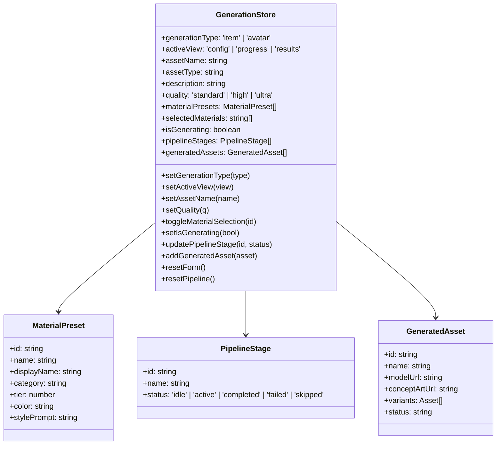

# State Management Flow Diagrams

This document provides comprehensive diagrams illustrating Asset Forge's state management architecture using Zustand, including store interactions, middleware flow, and state synchronization patterns.

## Store Architecture Overview


## Generation Store State Flow

### State Structure



### Generation Workflow State Transitions


### Action Flow Example: Starting Generation


## Assets Store State Flow

### Asset Management State Structure


### Asset Loading Flow

```mermaid
flowchart TB
    Start([Component Mount])

    CheckCache{Assets in<br/>Store?}
    UseCache[Use Cached Assets]
    SetLoading[Set isLoading = true]

    FetchAPI[Call AssetService.loadAssets]
    ParseResponse[Parse API Response]
    ValidateAssets{Valid<br/>Asset Data?}

    UpdateStore[Store.setAssets(assets)]
    UpdateLoading[Set isLoading = false]
    TriggerRender[Re-render Components]

    HandleError[Log Error]
    ShowError[Display Error Message]

    Complete([Assets Loaded])

    Start --> CheckCache
    CheckCache -->|Yes| UseCache
    CheckCache -->|No| SetLoading
    UseCache --> Complete

    SetLoading --> FetchAPI
    FetchAPI --> ParseResponse
    ParseResponse --> ValidateAssets

    ValidateAssets -->|Valid| UpdateStore
    ValidateAssets -->|Invalid| HandleError

    UpdateStore --> UpdateLoading
    UpdateLoading --> TriggerRender
    TriggerRender --> Complete

    HandleError --> ShowError
    ShowError --> UpdateLoading

    classDef process fill:#e3f2fd,stroke:#1976d2,stroke-width:2px
    classDef decision fill:#fff9c4,stroke:#f9a825,stroke-width:2px
    classDef error fill:#ffebee,stroke:#c62828,stroke-width:2px
    classDef endpoint fill:#e8f5e9,stroke:#388e3c,stroke-width:2px

    class CheckCache,ValidateAssets decision
    class FetchAPI,ParseResponse,UpdateStore,UpdateLoading,TriggerRender process
    class HandleError,ShowError error
    class Start,Complete endpoint
```

### Asset Filtering State Flow


## Armor Fitting Store State Flow

### Fitting State Structure


### Fitting Process State Flow


## Hand Rigging Store State Flow

### Rigging State Structure


### Rigging Process State Transitions


## Middleware Flow Details

### Immer Middleware Flow


### Persist Middleware Flow


### State Hydration on App Load


## Cross-Store Communication

### Store Interaction Patterns


### Event-Based Communication Example


## Performance Optimization Patterns

### Selective Subscriptions


---

## State Management Best Practices

### 1. Single Responsibility
Each store manages a specific domain:
- **GenerationStore**: Pipeline configuration and execution
- **AssetsStore**: Asset library and filtering
- **ArmorFittingStore**: Fitting workflow state
- **HandRiggingStore**: Rigging workflow state
- **DebuggerStore**: Development utilities

### 2. Immutability
All state updates use Immer for guaranteed immutability:
```typescript
set((state) => {
  state.assetName = "New Name" // Looks mutable, actually immutable
})
```

### 3. Selective Subscriptions
Components subscribe only to needed state slices:
```typescript
const isGenerating = useGenerationStore(state => state.isGenerating)
// Only re-renders when isGenerating changes
```

### 4. Persistence Strategy
Only persist user preferences, not transient state:
- ✅ Persist: Configuration, selected materials, UI preferences
- ❌ Don't persist: Loading states, temporary data, large assets

### 5. State Normalization
Keep state flat and normalized:
- Assets stored as array, not nested tree
- Use IDs for relationships
- Compute derived state in selectors

---

This comprehensive state management documentation provides deep insight into Asset Forge's Zustand architecture, middleware stack, and state flow patterns. For implementation details, refer to the `/src/store/` directory.
